# API COM SPRING BOOT - BÁSICO

## Criando Estrutura básica

No caso do Spring Boot, podemos usar o <a href="https://start.spring.io/" target="_blank">Spring Initializr</a> que é uma ferramenta online disponibilizada pela equipe do Spring Boot para criar o projeto com toda estrutura inicial necessária.

Acessando o Spring Initializr, serão exibidos alguns campos para preenchermos sobre o projeto e na parte inferior da tela, temos três botões, sendo o primeiro "Generate" para gerar o projeto.

Esse tutorial é baseado em uma aplicação CRUD, então as dependências mencionadas são para atender as necessidades de tal. 

Cada projeto tem suas dependências específicas.

[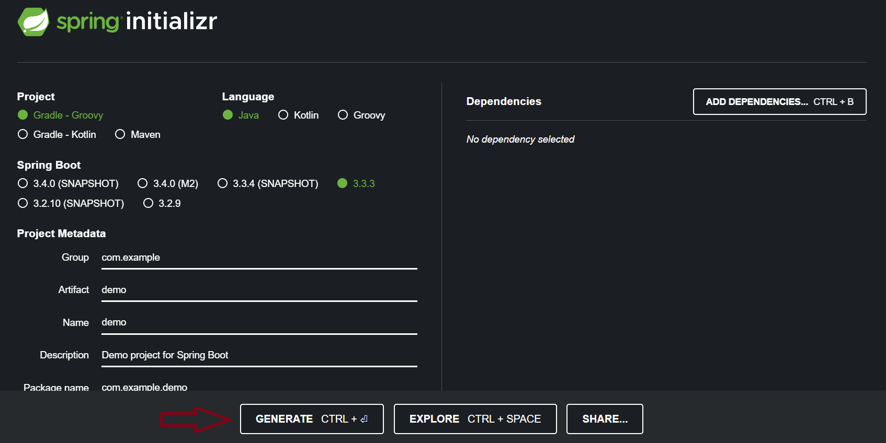](./img/api_spring_boot/acessando_spring_initializr.png)

A primeira opção é para selecionar qual ferramenta de gestão de dependências e de build queremos usar. 

Podemos escolher entre Gradle e Maven.
 
Como o projeto vai usar o Maven como, deixaremos marcado a opção **"Maven Project"**. 

Em **"Language"** deixaremos marcada a opção **"Java"**, que será a linguagem que usaremos.

Na parte **"Spring Boot"**, vamos selecionar a versão do Spring Boot que desejamos gerar o projeto. 

Em "Project Metadata" são solicitadas informações para o Maven configurar o projeto. 

No campo "Packaging" é para escolhermos como o projeto será empacotado, pode deixar a opção padrão Jar selecionada.

À direita da tela temos a seção "Dependencies" e um botão "Add dependencies" (com o atalho "Ctrl + B"). Nela, adicionaremos as dependências do Spring que desejamos incluir no projeto. Para isso, vamos clicar no botão "Add dependencies".

Será aberta uma pop-up com diversas dependências do Spring Boot, e do Spring para selecionarmos. 
Vamos apertar a tecla **"Ctrl"** do teclado(*) e clicar em cada uma das dependências que desejamos adicionar, sendo elas:

- Spring Boot DevTools
- Lombok
- Spring Web

(*) - Quando apertamos a tecla **"Ctrl"** do teclado ao selecionar as dependências desejadas, a pop-up com as opções não se fecha cada vez que você selecionar uma opção.

O Spring Boot DevTools é um módulo do Spring Boot que serve para não precisarmos reiniciar a aplicação a cada alteração feita no código. Isto é, toda vez que salvarmos as modificações feitas no código, ele subirá automaticamente.

Já o Lombok não é do Spring, é uma ferramenta para gerar códigos, como esses códigos verbosos do Java, de getter e setter, baseado em anotações. Usaremos o Lombok para deixarmos o código mais simples e menos verboso.

A próxima dependência é a Spring Web, dado que vamos trabalhar com uma API Rest e precisamos do módulo web. A princípio deixaremos somente essas três dependências, sem incluir as de banco de dados, de migration e de segurança. Mas conforme formos desenvolvendo o projeto, podemos ir adicionando de forma manual.

Deixe tudo como na imagem abaixo:

[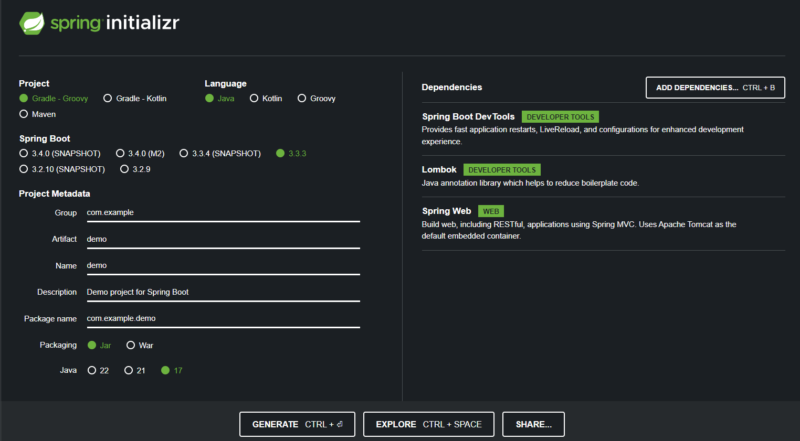](./img/api_spring_boot/spring_initializr_config_basica.png)

Após isso, apertamos a tecla **"Esc"** para fechar a pop-up. À direita, em **"Dependencies"**, perceba que temos as três listadas.

Depois de preenchermos todas as informações e adicionarmos as dependências, podemos selecionar o botão **"Generate"** na parte inferior da página.

Dessa forma, vamos gerar o projeto e teremos um arquivo .zip com o projeto compactado. Após finalizado o download, clicaremos no arquivo api.zip para abrir.

Criamos o projeto, baixamos o arquivo zip e o descompactamos. 
Agora, podemos importar na IDE e começar a trabalhar no código.

---


## Configurando DEVTOOLS

A dependência do DevTools que adicionamos, é para facilitar o desenvolvimento para que não se precise reiniciar manualmente o projeto todas as vezes que for feita uma alteração no código. Basta salvar que o projeto vai reiniciar automaticamente e as alterações serão subidas.

Para isso devemos ir em Settings (Configuração para IDE INTELLIJ):

[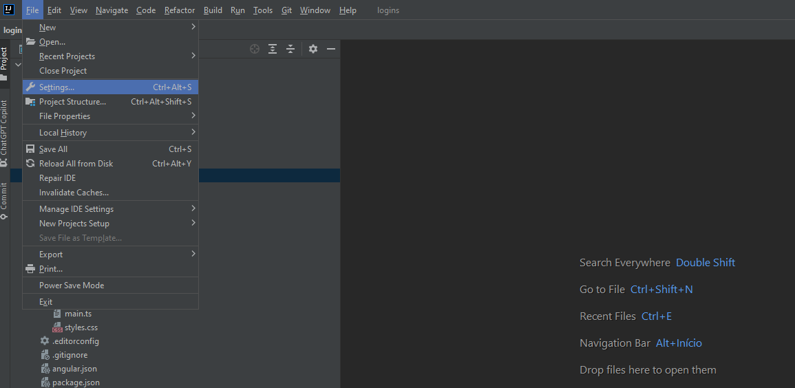](./img/api_spring_boot/acessando_settings_intellij.png)


Na opção **Build**, **Execution**, **Deployment** devemos caminhar até Compiler e selecionar a opção Build project automatically:

[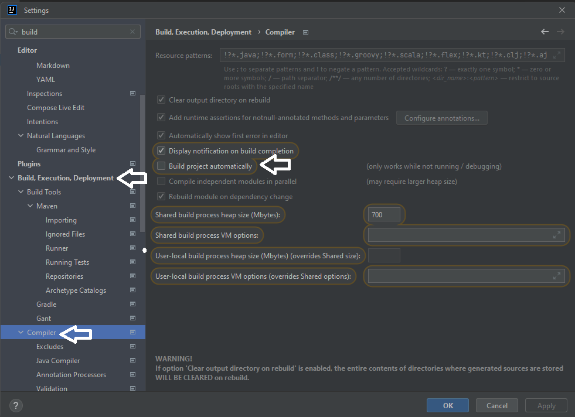](./img/api_spring_boot/set_build_automatically.png)

Depois vá até o final das opções em **Advanced Settings** e marque a opção **Allow auto-make to start even if developed application is currently running**. 


[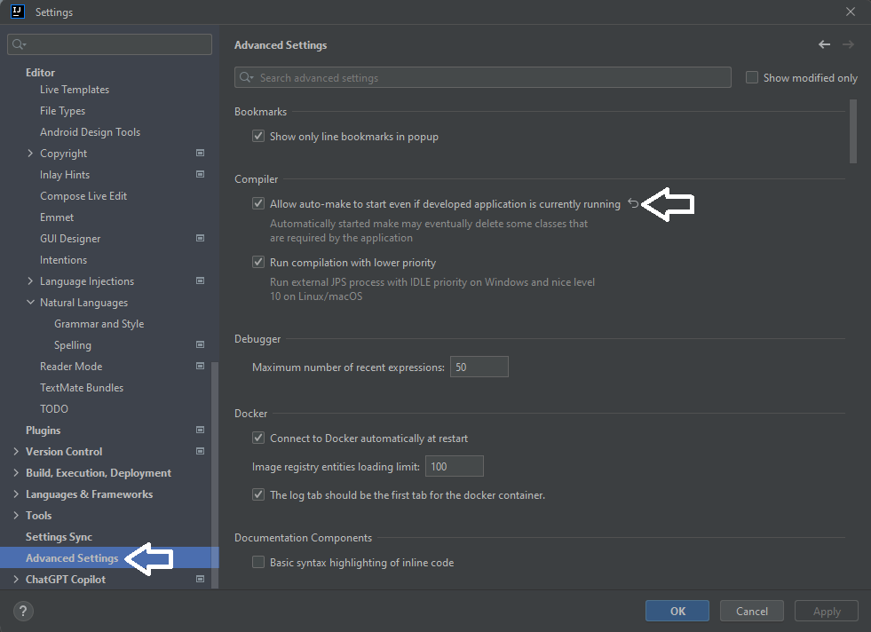](./img/api_spring_boot/allow_auto_make.png)

---

## Criando Controller

Uma - classe - Controller é uma parte do padrão de arquitetura chamado **"MVC"** (Model-View-Controller). 

A Controller é responsável por receber todas as requisições do usuário. Seus métodos chamados actions são responsáveis por uma página, controlando qual model/entidade usar e qual view/dto será mostrado ao usuário.

Para que o Spring reconheça a classe como uma Controller, ela deve ser anotada com **@Controller** ou com **@RestController**
 e cada um dos métodos dentro da controller que tenha uma URI configurada, precisa ser anotada com a anotação correspondente
  ao método HTTP referente (**@GetMapping**, **@PostMapping**,**@DeleteMapping**, etc).

Exemplo:
```
@RestController
@RequestMapping("/teste")
public class TesteController {

    @GetMapping
    public String teste(){
        return "Testando";
    }
}
```

---


## Subindo Aplicação Localmente

Para subirmos a aplicação localmente para testar, devemos ir até a classe que possuir o método main (Padrão de aplicações Java, pois é através desse método
 que a aplicação é iniciada) e clicar em no botão de play como na imagem abaixo (Usando IDE Intellij):

 [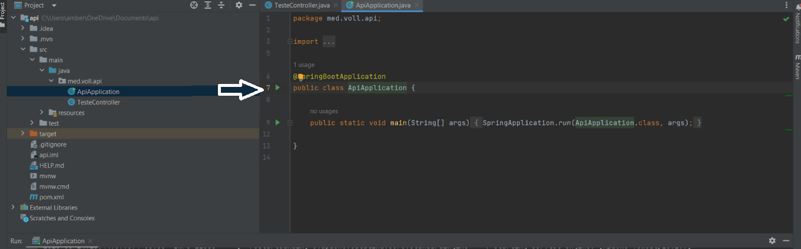](./img/api_spring_boot/play_main_class.png)


Com isso, a aplicação é subida a porta 8080 e já podemos fazer uma requisição ao uma URI da controller caso já tenha sido implementada usando o navegador
 ou uma ferramenta como [Postman](https://www.postman.com/downloads/) ou [Insomnia](https://insomnia.rest/download).
 
 Exemplo:

http://localhost:8080/teste

Depois de subir a aplicação a primeira vez, mais ao canto superior direito da IDE fica já selecionada a classe que possui o método main. 
Para subir das próximas vezes basta clicar no botão de play:

[](./img/api_spring_boot/play_main_class.png)


Para derrubar a aplicação:

[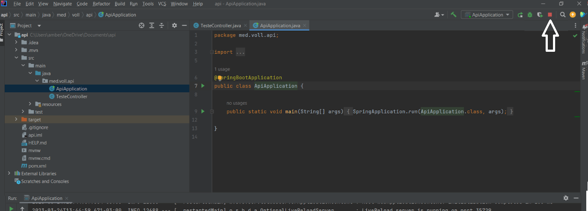](./img/api_spring_boot/stop_main_class.png)

---

## Recebendo Dados da Requisição

Quando requisições HTTP como Post são feitas, geralmente elas vêm com dados em um corpo (body) na requisição. 
Para obter esse dados, no método da controller correspondente, passamos um parâmetro que vai receber esse body, porém isso não é suficiente, 
pois precisamos informar ao Spring que essa esse parâmetro receberá o body da requisição e para isso é preciso usar a anotação @RequestBody antes do parâmetro:

```
@PostMapping
    public void create(@RequestBody String json){
        System.out.println(json);
    }
```

### Criando DTO

Somente com o código acima, já conseguimos obter o body em formato String.
Para já receber esse body e converter em um objeto java, precisamos implementar uma classe que represente esse objeto. Chamamos esse tipo de classe de DTO.

DTO (Data Transfer Object) é um padrão de software voltado para a transferência de dados entre as camadas de uma aplicação. Ele consiste basicamente no 
entendimento de como as informações trafegam dentro de um sistema.

DTO significa "Data Transfer Object", que em português significa "Objeto de Transferência de Dados". É uma classe simples que é usada para transferir dados 
entre camadas de uma aplicação, como por exemplo entre a camada de apresentação e a camada de serviço.

Uma das principais razões para utilizar DTOs em uma API é para evitar a exposição desnecessária de dados sensíveis ou confidenciais da aplicação. Ao invés 
de expor diretamente os objetos de domínio, que podem conter informações que não devem ser expostas publicamente, os DTOs permitem que somente as informações 
relevantes e necessárias sejam enviadas para o cliente.

Além disso, o uso de DTOs também ajuda a reduzir o acoplamento entre as camadas da aplicação, permitindo que as mudanças em uma camada não afetem as outras camadas.
 Isso facilita a manutenção e evolução da aplicação.


Antes do java 14, para criar um DTO criávamos uma classe normal tendo a necessidade de criar os campos, implementar métodos getters, setters, equals, 
hashCode e toString()

Agora temos a opção de ao invés de criar a DTO usando a palavra reservada **class**, usamos a palavra chave **record**.

Um Record, nada mais é que um tipo de classe que armazena dados. É a mesma ideia de construção similar a um JavaBean, possui construtor, 
atributos e métodos acessores. Porém, ao invés de possibilitar qualquer alteração a classe é imutável. Também possui os métodos equals, hashCode e toString().

:::info
Um Record é imutável, ou seja,se precisar de uma DTO que precise alterar algum dado, será preciso criar uma classe normal.
:::
Exemplo:

```
public record DoctorDto(String name, String email, String crm, Specialty specialty, Address address) {}
```

Agora voltando ao método da classe controller, ao invés de nos parâmetros esperarmos uma String, vamos esperar um DoctorDto:
```
@PostMapping
    public void create(@RequestBody @Valid DoctorDto doctorDto){
        System.out.println(doctorDto);
    }
```
Onde:

- @RequestBody Diz ao spring que as informações referente ao DoctorDto virão no body da requisição

- @Valid diz ao Spring que todos os campos de DoctorDto devem ser validados (Caso seus campos tenham recebido anotações de validação. 
Veja aqui como implementar validações)

---

## Adicionando Dependência Banco de Dados (MYSQL)

Caso ainda não tenha configurado o servidor MYSQL localmente, você pode seguir esse material: 
[Criando container MYSQL](../general/criando_docker_compose_mysql.md)

Para adicionar as dependências necessárias, podemos acessando o Spring Initializr e na mesma forma que foi visto no primeiro capítulo, vamos criar um novo projeto e adicionar as seguintes dependências:

- Validation (Para validação com Hibernate Validator)
- Mysql Driver
- Spring Data JPA ( API para persistência de dados que usa Spring Data e Hibernate)
- Flyway Migration

Agora ao invés de gerar o projeto e baixar,vamos apenas no botão Explore:

[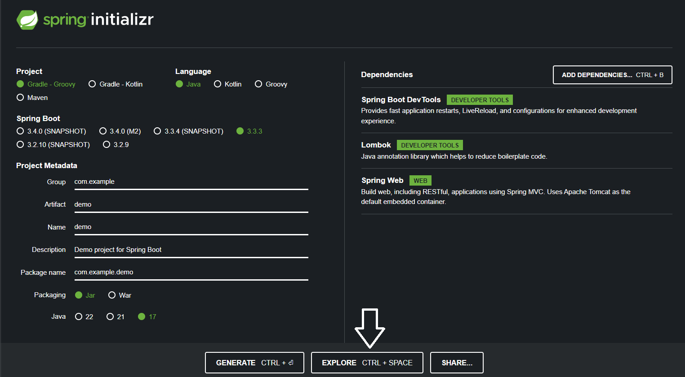](./img/api_spring_boot/spring_initializr_explore.png)

Será exibido o conteúdo do arquivo **pom.xml** (Se for Maven) ou **build.gradle** (Se for Gradle).
É nele que são informadas todas as dependências do nosso projeto.
Devemos copiar todas as tags dependency que estão dentro da tag dependencies:

[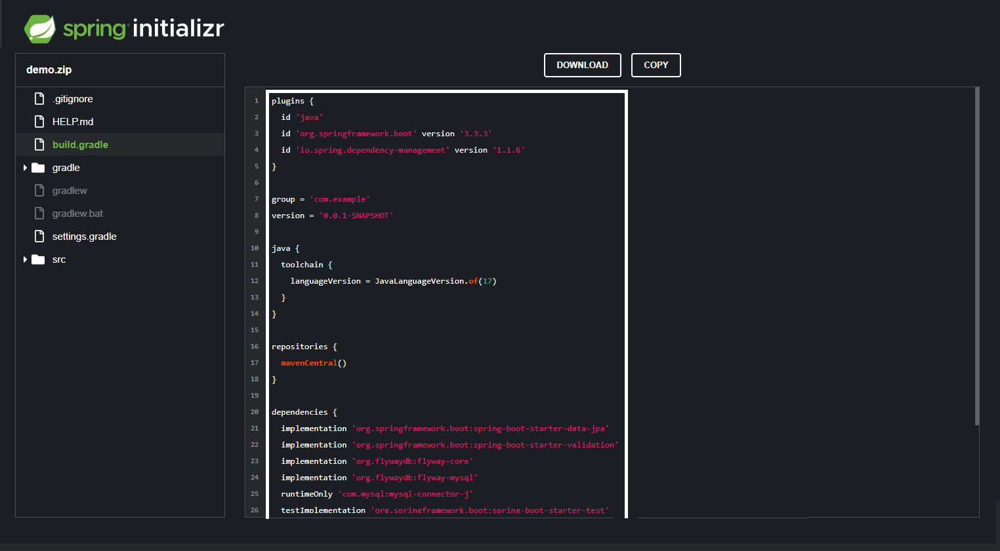](./img/api_spring_boot/spring_initializr_mysql_dependencies.png)

E agora colar adicionando as dependências já existentes dentro do pom.xml do nosso projeto.

FINALIZE O PROJETO SE ESTIVER RODANDO e atualize o Maven ou Gradle:

[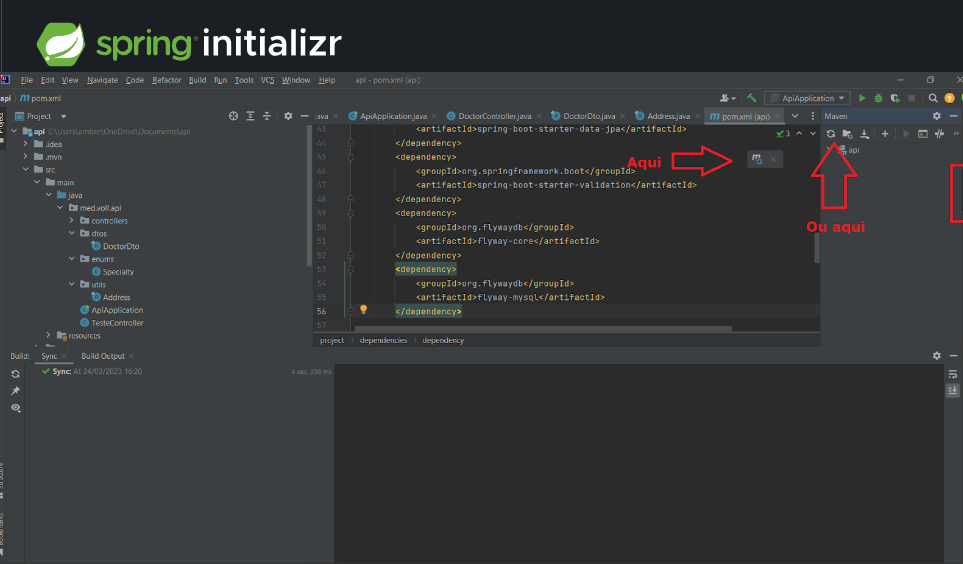](./img/api_spring_boot/atualizar_maven_ou_gradle.png)

Se executarmos a aplicação, perceberemos que um erro foi identificado. Isso faz com que a inicialização do projeto seja parada. No log, 
descobrimos que isso aconteceu porque algumas configurações do DataSource não foram feitas:

[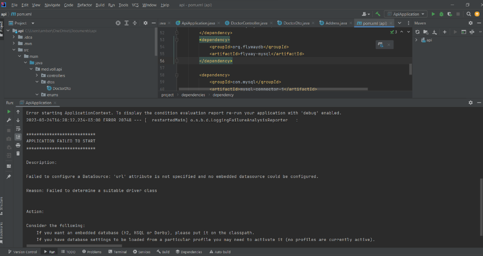](./img/api_spring_boot/erro_config_datasource.png)


Vamos fazer isso no arquivo **"src > resources > application.properties"** ou **"src > resources > application.yaml"**. 
Precisamos adicionar três propriedades a ele: 
a URL de conexão com o banco de dados, o login e a senha do banco de dados.

Como esse arquivo funciona seguindo a lógica chave-valor, vamos passar algumas chaves para configurar URL, username e password no banco de dados.

Para passar a URL de conexão com o banco de dados, vamos inserir o código:

application.properties:  
```
spring.datasource.url=jdbc:mysql://localhost/nomeDoBanco  
spring.datasource.username=usuario  
spring.datasource.password=senha  
```
application.yaml:  
```
spring:  
  datasource:  
    url: jdbc:mysql://localhost/nomeDoBanco  
    username: usuario  
    password: senha  
```
Se não tiver criado o banco ainda, acesse [Criando container MYSQL](../general/criando_docker_compose_mysql.md) para saber como fazer.

---

## Criando Entidade

Plain and Old Java Object ou POJO, como chamamos objeto java.
Ou seja, uma classe simples apenas com seus atributos, getters and setters

As entidades JPA são POJOS (Plain Old Java Objects), que são objetos com design simplificado, ou seja, sem nada de especial. Essas entidades representam uma tabela do banco de dados, e cada instância desse objeto representa uma linha da tabela.

Exemplo:

```
@Table(name = "doctors")
@Entity
@Getter
@NoArgsConstructor
@AllArgsConstructor
public class Doctor {

    @Id
    @GeneratedValue(strategy = GenerationType.IDENTITY)
    private Long id;

    private String name;

    private String email;

    private String crm;
@Enumerated(EnumType.STRING)
    private Specialty specialty;
    @Embedded
    private AddressDto addressDto;

}
```

Onde:

- **@Table** é usada para especificar o nome da tabela do banco de dados que será mapeada pela classe. Essa anotação não é obrigatória,
 mas se você não usá-la, o Hibernate irá usar o nome da classe como o nome da tabela.


- **@Entity** é utilizada para informar que uma classe também é uma entidade. A partir disso, a JPA estabelecerá a ligação entre a entidade e uma
  tabela de mesmo nome no banco de dados, onde os dados de objetos desse tipo poderão ser persistidos.


- **@id** indica que a entidade terá como identificador único o campo anotado por ela, e esse campo estará relacionado à coluna de mesmo nome na
   tabela do banco de dados, a qual representa a chave primária (primary key).


- **@GeneratedValue** é utilizada para informar que a geração do valor do identificador único da entidade será gerenciada pelo provedor de persistência. 
Essa anotação deve ser adicionada logo após a anotação @Id.
Provedor de persistência, saiba que estamos referenciando o framework escolhido para que a aplicação possa se comunicar com o banco de dados. 
Alguns exemplos são o Hibernate, EclipseLink e OpenJPA.


- **@Enumerated** é usado para podermos instruir um provedor JPA a converter uma enumeração em seu valor ordinal ou String. 
Temos duas opções:
    - **EnumType.STRING** retorna no nome item do enum
    - **EnumType.ORDINAL** retorna a posição do item do enum dentro do mesmo.


Exemplo:

```
public enum Specialty {

    ORTOPEDIA,
    CARDIOLOGIA,
    GINECOLOGIA,
    DERMATOLOGIA;

}
```
Se um campo receber como valor CARDIOLOGIA e tiver anotado com **@Enumerated(EnumType.STRING)**, o campo terá o valor CARDIOLOGIA, 
porém se for anotado com **@Enumerated(EnumType.ORDINAL)** será gravado a posição deste item dentro do enum que no caso de CARDIOLOGIA 
é 1 (Começa sempre de 0).

- A anotação **@Embedded** é usada quando um uma entidade tem um campo cujo tipo é outra classe java, porém não representa uma tabela no banco de dados, 
assim, ao inves de salvar os dados em outra tabela, os dados são salvos dentro da tabela que possui esse campo.

Exemplo:

Uma classe/entidade Medico tem um campo do tipo Endereco, Endereco é uma classe com seus próprios campos (Rua, número, bairro, etc), 
porém ela não existe no banco de dados, mas precisamos salvar o endereço direto na tabela médico.
Então anotamos o campo da tabela Medico referente ao Endereco com **@Embedded** e a classe Endereco anotamos com **@Embeddable**.


---

## Criando Reponsitory

Um Repository é a classe responsável por todo acesso a dados de uma Entidade, ações como incluir, editar, apagar, e diversas consultas ficam no repositório. 
No Spring Boot a gente só declara uma interface que implementa uma das classes CrudRepository ou JpaRepository (Essa última implementa a primeira).

A interface ficaria assim:
```
@Repository
public interface DoctorRepository extends JpaRepository<Doctor, Long> {
}
```
Onde:


- Doctor é a classe/entidade que representa a tabela do banco de dados que o repository vai acessar


- Long é o tipo da chave primária da classe/entidade que representa a tabela do banco de dados que o repository vai acessar


Quando a aplicação subir, o Spring por debaixo dos panos cria uma classe que implementa essa interface e cria um objeto dessa classe.

Contamos com a criação de método de busca usando o nome do campo.  
Por exemplo, a entidade tem um campo name, então na interface repository devemos ter o método **findByName**.  
O próprio Spring boot nos bastidores vai construir query baseado no nome do método que nesse exemplo ficaria aqui:

```
Select @ from nomeTabela where name:=’Maria’;
```

Da mesma forma, se tivermos um campo **enderecoComercial**, o método seria **findByEnderecoComercial** e a query:

```
Select @ from nomeTabela where endereco_comercial:=xpto;
```

Temos também a opção de criar digitar nossas queries usando a anotação @Query acima do método, exemplo:
```
@Query("select s from Student s where s.s_name=?")
List<Student> findBySName();
```

---

## Criando Service

Uma service é a classe que fará a ligação entre o controller e a repository.  
É nela também que implementamos regras de negócio.  

Código básico de exemplo de uma service já com método que cadastra um novo registro:  
```
@Service
public class DoctorService {

    @Autowired
    DoctorRepository repository;
    @Transactional
    public DoctorDto save(DoctorDto doctorDto){
        Doctor doctorRequest = Doctor.dtoToDoctor(doctorDto);
        Doctor doctorReponse = repository.save(doctorRequest);
        return DoctorDto.doctorToDto(doctorReponse);
    }
    ```
Onde:

- @Service é uma anotação que diz ao Spring que quem vai manejar essa classe será ele.

- @Autowired é uma anotação para dizer ao Spring Security que ele crie uma instância dessa classe do tipo do campo quando for necessário
 injetando ele na classe onde foi chamada.


- @Transactional permite que caso durante a alteração ou inserção de dados no banco, se ocorrer algum problema, evitar que sejam persistidas 
alterações pela metade. Ou conclui toda a alteração, ou desfaz o que já foi feito


---

## Validando Dados

Ao criar o projeto base no site **Spring Initializr**, adicionamos a dependência **Hibernate Validator** (spring-boot-starter-validation).  
 Sempre que estamos realizando o desenvolvimento de alguma aplicação, precisamos que ela nos responda o mais rápido possível caso tenha algum
  problema com a nossa requisição.   

O **Spring Validation** veio para nos ajudar com essa situação, disponibilizando várias anotações que adicionando-as acima de um campo de classe, 
já vai validar o campo de acordo com a anotação escolhida sem precisar de nos preocupar com implementar códigos adicionais para isso.  

Algumas anotações que são bem comuns de serem vistas em projetos que utilizam o **Spring Validation** (Do pacote jakarta.validation.constraints).  

**@NotNull** -> Válida se o campo está nulo.

**@NotEmpty** -> Válida se o campo está vazio.

**@NotBlank** -> Válida se o campo está nulo ou vazio.

**@Past** -> Válida se a data é hoje ou qualquer dia antes de hoje.

**@Future** -> Válida se a data é hoje ou qualquer dia depois de hoje.

**@Length** -> Válida o tamanho mínimo e máximo de um campo.

**@Max** -> Válida o tamanho máximo de um campo.

**@Min** -> Valida o tamanho mínimo de um campo.

Lembrando que a maioria dessas anotações aceita entre parênteses preencher um atributo ‘message’ que é a mensagem que será mostrada caso a 
validação não passe.  

Exemplo de uso:

```
import com.eq3.app.dtos.ClientDto
import jakarta.persistence.Entity
import jakarta.persistence.GeneratedValue
import jakarta.persistence.Id
import jakarta.validation.constraints.NotBlank
import java.util.UUID


@Entity
data class Client(
    @Id
    @GeneratedValue(generator = "UUID")
    val id: UUID? = null,
    @NotBlank(message = "Nome deve ser informado e não pode ser vazio!")
    val name: String,
    @NotBlank(message = "O CPF deve ser informado e não pode ser vazio!")
    val cpf: String
) {
    constructor(clientDto: ClientDto):this(null, clientDto.name, clientDto.cpf)
}
```


---

## Criando Cadastro (Método HTTP POST)

```
@PostMapping
    public ResponseEntity<DoctorDto> save(@RequestBody @Valid DoctorDto doctorDto){
        return new ResponseEntity<>(service.save(doctorDto), HttpStatus.CREATED);
    }
    ```

Como já temos a service, injetamos ela na controller também.  

Onde:  
- **@PostMapping** é a anotação para dizer o Spring que o método HTTP utilizado pela requisição é POST

- No retorno estamos retornando uma **ResponseEntity**.
Uma resposta HTTP é composta basicamente de cabeçalho (**header**), status code e um corpo (**body**), que é o conteúdo dessa resposta.
 A classe **ResponseEntity** nos permite manipular a resposta como um todo, ou seja, todos os itens citados acima, nos dando um pouco mais de 
 flexibilidade quando desejamos utilizar alguma lógica para devolver um ou outro tipo de status e/ou conteúdo no corpo dessa resposta.

 - **service.save(doctorDto)** é a service que faz a comunicação entre o controller e o repository. Veja aqui como implementar.

 - **@RequestBody** Diz ao spring que as informações referente ao DoctorDto virão no body da requisição

 - **@Valid** diz ao Spring que todos os campos de DoctorDto devem ser validados (Caso seus campos tenham recebido anotações de validação. Veja aqui como implementar validações)

É bom lembrar que para cada método no controller, é preciso ter um correspondente na service, pois como já dito, o controller nunca chama diretamente uma respository, ficando a cargo da service fazer isso, então a controller vai chamar a service e essa última que chama a reponsitory. 
Essa é uma boa prática que propicia o baixo acoplamento, ou seja, se precisarmos fazer mudar ao na conexão com o banco de dados, por exemplo, vamos mexer só na repository deixando o restante intacto. 


---

## Criando Consulta (Método HTTP GET)

```
@GetMapping
    public ResponseEntity<List<DoctorShowDatasDto>> listAll(){
        return new ResponseEntity<>(service.findAll(), HttpStatus.OK);
    }
```
Onde:  
- **@GetMapping** é a anotação para dizer o Spring que o método HTTP utilizado pela requisição é GET


É bom lembrar que para cada método no controller, é preciso ter um correspondente na service, pois como já dito, o controller nunca chama 
diretamente uma respository, ficando a cargo da service fazer isso, então a controller vai chamar a service e essa última que chama a reponsitory.   
Essa é uma boa prática que propicia o baixo acoplamento, ou seja, se precisarmos fazer mudar ao na conexão com o banco de dados, por exemplo, 
vamos mexer só na repository deixando o restante intacto. 


---

## Criando Alteração (Método HTTP PUT)

Para criar o método para atualizar um registro, precisamos criar uma DTO que possua somente os dados que queremos alterar, 
pois nem sempre vai alterar todos os dados.  

No controller, o método é bem parecido com o de criar um registro, alterando apenas a DTO e o método da service:  
```
@PutMapping
    public ResponseEntity<DoctorUpdatedDto> update(@RequestBody @Valid DoctorUpdatedDto doctorUpdatedDto){
        return new ResponseEntity<>(service.update(doctorUpdatedDto), HttpStatus.OK);
    }
    ```
Já na service, devemos implementar um método que primeiro verifique se um usuário existe e já o recupere do banco de dados,
 caso exista, alteramos os dados do objeto capturado do banco de dados para os dados do objeto vindo da requisição, já verificando se algum valor veio nulo, caso tenha vindo nulo, o valor permanece como está, se não vier nulo, é alterado para o que recebemos na requisição, e por último chamamos o método salvar da repository:
 ```
public DoctorUpdatedDto update(DoctorUpdatedDto doctorUpdatedDto) {
        Optional<Doctor> doctor = repository.findById(doctorUpdatedDto.id());
        if(doctor.isPresent()){
            Doctor doctorToUpdate = doctor.get();
            doctorToUpdate.setName(doctorUpdatedDto.name() != null ? doctorUpdatedDto.name(): doctorToUpdate.getName());
            doctorToUpdate.setEmail(doctorUpdatedDto.email() != null ? doctorUpdatedDto.email(): doctorToUpdate.getEmail());
            doctorToUpdate.setCrm(doctorUpdatedDto.crm() != null ? doctorUpdatedDto.crm(): doctorToUpdate.getCrm());
            doctorToUpdate.setSpecialty(doctorUpdatedDto.specialty() != null ? doctorUpdatedDto.specialty(): doctorToUpdate.getSpecialty());
            Doctor doctorReponse = repository.save(doctorToUpdate);
            return DoctorUpdatedDto.doctorToUpdatedDto(doctorReponse);


        }else{
            throw new RuntimeException("Usuário com id " + doctorUpdatedDto.id() + " não foi existe!");
        }
    }
    ```
Caso o usuário informado na requisição não exista, é lançada uma exceção.  

É bom lembrar que para cada método no controller, é preciso ter um correspondente na service, pois como já dito, o controller nunca chama diretamente uma respository, ficando a cargo da service fazer isso, então a controller vai chamar a service e essa última que chama a reponsitory. 
Essa é uma boa prática que propicia o baixo acoplamento, ou seja, se precisarmos fazer mudar ao na conexão com o banco de dados, por exemplo, vamos mexer só na repository deixando o restante intacto. 


---

## Criando Alteração 2 (Método HTTP PATCH)


Escolher entre o método **HTTP PUT** ou **PATCH** é uma dúvida comum que surge quando estamos desenvolvendo APIs
 e precisamos criar um endpoint para atualização de recursos. Vamos entender as diferenças entre as duas opções e quando utilizar cada uma.  

 **PUT**
O método **PUT** substitui todos os atuais dados de um recurso pelos dados passados na requisição, ou seja, 
estamos falando de uma atualização integral. Então, com ele, fazemos a atualização total de um recurso em apenas uma requisição.  

**PATCH**
O método **PATCH**, por sua vez, aplica modificações parciais em um recurso. Logo, 
é possível modificar apenas uma parte de um recurso. Com o PATCH, então, realizamos atualizações parciais, 
o que torna as opções de atualização mais flexíveis.

Qual escolher?  
Na prática, é difícil saber qual método utilizar, pois nem sempre saberemos se um recurso será atualizado parcialmente ou totalmente em
 uma requisição - a não ser que realizemos uma verificação quanto a isso, algo que não é recomendado.  

O mais comum então nas aplicações é utilizar o método PUT para requisições de atualização de recursos em uma API.

---

## Criando Exclusão (Método HTTP DELETE)

Podemos passar um parâmetro dinâmico na URI adicionando uma barra e o ID do registro. 
Exemplo:  
http://localhost:8080/medicos/3  

O método no controller deve ter a anotação @DeleteMapping. Para levar o ID, 
vamos abrir parênteses nessa anotação e entre aspas colocar o nome do parâmetro refente ao id:

```("{Id}")```

Para obter esse valor da URI, passamos Long id como parâmetro do método e informando ao Spring que ele se trata do ```("{Id}")```
 adiconando **@PathVariable** antes parâmetro do método.  

Também adicionaremos o método **@Transactional** abaixo de **@DeleteMapping**. 

O método na controller deve ficar basicamente assim:
```
@DeleteMapping("{id}")
    public ResponseEntity<String> delete(@PathVariable Long id){
        return new ResponseEntity<>(service.delete(id), HttpStatus.OK);
    }
```

Devemos implementar na service também um método que vai receber como parâmetro o id e no corpo do método,
 verificar primeiro se o registro existe no banco de dados, se sim,  chamar **.deleById(id)** da interface repository para fazer o delete
  no banco de dados, senão, retorna uma exceção:  
```
public String delete(Long id){
        Optional<Doctor> doctorToDelete = repository.findById(id);

        if(doctorToDelete.isPresent()){
            repository.deleteById(id);
            return "Médico excluído com sucesso!";
        }else{
            throw new RuntimeException("Médico não encontrado com id " + id);
        }


    }
```

---

## Criando Paginação

O recurso de paginação permite ao buscar todos os registros de uma tabela, podemos controlar a quantidade de registros que irá aparecer por requisição evitando assim que milhares de registros sejam exibidos de uma só vez causando problema de latência. 
Como paginação é algo comum, o Spring já tem um mecanismo para fazer isso.

Usando o capítulo Criando Consulta (MÉTODO HTTP GET) como exemplo,
 basta fazer algumas poucas alterações diretamente no método da controller.  
Basicamente as alterações são:  

- Nos parâmetros do método da controller, passamos um parâmetro do tipo Pageable (Do pacote org.springframework.data.domain.Pageable)

- no retorno do método ao invés de retornar uma ResponseEntity de ```List<T>``` normal onde T é o tipo da sua lista, será retornada uma ResponseEntity
     de ```Page<T>``` onde T é o tipo da sua lista. Page tem que ser do pacote import org.springframework.data.domain.Page.
Page é uma interface do Spring que além de retornar uma List, também devolve informações sobre a paginação (Número de páginas, número de registros, etc).


- Alterar o método da service para receber um objeto de Pageable como parâmetro


- Implementar a assinatura de um método na repository que nos parâmetros tenha um objeto de Pageable, ou se já for um método já existente da interface Repository, chamar uma sobrecarga do método que também vai receber um objeto de Pageable como parâmetro para que o Spring já monte a query com o esquema de paginação


Como essas alterações, se fizermos a requisição como a mesma URI usada antes, nada será alterado na resposta porque para que funcione, ou seja, venha com uma determinada quantidade de registros por página, é preciso informar isso na URI.


Comparando antes e depois:

Na controller

Antes:
```
@GetMapping
    fun findAllFromLoggedUser():ResponseEntity<List<LoginDto.LoginDtoWithoutUserLoginsWithId>>{
        return ResponseEntity(service.findAllFromLoggedUser(), HttpStatus.OK)
    }
```
Depois:
```
@GetMapping
    fun findAllFromLoggedUser(pageable: Pageable):ResponseEntity<Page<LoginDto.LoginDtoWithoutUserLoginsWithId>>{
        return ResponseEntity(service.findAllFromLoggedUser(pageable), HttpStatus.OK)
    }
```

Na service

Antes:
```
fun findAllFromLoggedUser(): List<LoginDto.LoginDtoWithoutUserLoginsWithId> {
        val loggedUser = SecurityContextHolder.getContext().authentication.principal as UserModel
        val logins = loginRepository.findByUserId(loggedUser.id!!)
        return logins.stream().map{LoginDto.LoginDtoWithoutUserLoginsWithId(it)}.toList()
    }
```
Depois:
```
fun findAllFromLoggedUser(pageable: Pageable): Page<LoginDto.LoginDtoWithoutUserLoginsWithId> {
        val loggedUser = SecurityContextHolder.getContext().authentication.principal as UserModel
        val logins = loginRepository.findByUserId(loggedUser.id!!, pageable)
        return logins.map{LoginDto.LoginDtoWithoutUserLoginsWithId(it)}
    }
```


Na repository:

Antes:
```
fun findByUserId(id: Long): List<Login>
```
Depois:
```
fun findByUserId(id: Long, pageable: Pageable): Page<Login>
```


Exemplo:

Se antes nossa URI era:

http://localhost:8080/doctors

Se adicionarmos ao final ?size=1, o Spring vai ler essa informação automaticamente essa informação e passar para o objeto Pageable passado no controller.
Com ?size=inteiro estamos informando quantos registros por página desejamos exibir:

http://localhost:8080/doctors?size=1

Da mesma forma, se informarmos page=inteiro, estamos informando o número de qual página queremos exibir.
page=1 vai exibir a página 1, page=2 vai exibir a página 2, e assim por diante

http://localhost:8080/doctors?size=1&page=1

---

## Ordenação

Também conseguimos determinar a ordem em que queremos que os dados sejam exibidos. Basta acrescentarmos sort=nomeDoCampo.

Num exemplo, se estamos trabalhando com uma tabela que tem um campo name, podemos informar na URI sort=name que irá trazer os registros ordenados pela coluna name (Na ordem alfabética).
Se quisermos que venha na ordem inversa, basta informar sort=name,desc.

Pageable traz por padrão  20 resultados por página, e na ordem em que cadastramos a informação no banco de dados. É possível, porém, alterar esse padrão usando a anotação @PageableDefault antes do parâmetro Pageable no método do controller.

Exemplo:
```
@GetMapping
    public ResponseEntity<Page<DoctorShowDatasDto>> listAll(@PageableDefault(size = 1, sort = {"email"}, direction = Sort.Direction.DESC) Pageable pageable){
        return new ResponseEntity<>(service.findAll(pageable), HttpStatus.OK);
    }
```
os valores dentro da anotação serão usados.

## Personalizando Parâmetros de Paginação e Ordenação
Conforme visto, os parâmetros utilizados para realizar a paginação e a ordenação devem se chamar page, size e sort.  
 Entretanto, o Spring Boot permite que os nomes de tais parâmetros sejam modificados via configuração no arquivo application.properties.  

Por exemplo, poderíamos traduzir para português os nomes desses parâmetros com as seguintes propriedades:

application.properties: 
``` 
spring.data.web.pageable.page-parameter=pagina
spring.data.web.pageable.size-parameter=tamanho
spring.data.web.sort.sort-parameter=ordem  
``` 


application.yaml:  
``` 
spring:  
  data:  
    web:  
      pageable:  
        page-parameter: pagina  
        size-parameter: tamanho  
      sort:  
        sort-parameter: ordem  
``` 

Com isso, nas requisições que utilizam a paginação, devemos utilizar esses nomes que foram definidos. Por exemplo,
 para listar os médicos de uma API trazendo apenas 5 registros da página 2, ordenados pelo e-mail e de maneira decrescente, a URL da requisição deve ser:

http://localhost:8080/medicos?tamanho=5&pagina=1&ordem=email,desc


