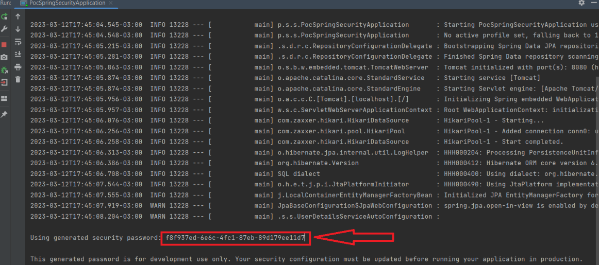

## Adicionando dependência do Spring Security

Adicione dentro da tag ```<dependencies>``` do **pom.xml** (Se for Maven) as seguintes dependências:
```
<dependency>
    <groupId>org.springframework.boot</groupId>
    <artifactId>spring-boot-starter-security</artifactId>
</dependency>

<dependency>
    <groupId>org.springframework.security</groupId>
    <artifactId>spring-security-test</artifactId>
    <scope>test</scope>
</dependency>
```
Após adicionar essas dependências, o spring security já será ativado e automaticamente todas as URLs da aplicação serão bloqueadas.
Por padrão, é gerado um login cujo usuário é user e a senha é gerada toda vez que a aplicação for subida localmente. Ela poderá ser visualizada nos logs como na imagem abaixo:

[](./img/spring_security/log_apos_inserir_dependencia.png)

Com esse login, ao fazer uma requisição para a API, a URI não será bloqueada.   
Esse login padrão só deve ser usado a nível de desenvolvimento. Nunca para produção.

---

## Implementando Nossa Própria Autenticação
### Criar Entidade Usuário 

Aqui criamos uma classe/entidade que irá representar nosso usuário no banco de dados:
```
@Entity
@Getter
@Setter
@Table(name = "user_model")
public class UserModel{
    @Id
    @GeneratedValue(strategy = GenerationType.IDENTITY)
    @Column(name = "user_id")
    private Long userId;
    @Column(nullable = false, unique = true)
    private String name;

    @Column(nullable = false)
    private String password;

    public UserModel() {
    }

    public UserModel(String name, String password) {
        this.name = name;
        this.password = password;
    }
}
```
Para essa POC eu usei DB MYSQL.  
Nesse caso é preciso ou criar a tabela no MYSQL ou configurar seu application.properties com o seguinte código:  

Criando a tabela manualmente:
```
CREATE TABLE user_model(user_id bigint not null auto_increment, name varchar(100) NOT NULL, password varchar(255) NOT NULL, PRIMARY KEY(user_id));
```
Configurando  para o Spring Boot criar a tabela no banco baseado na classe user_model:  
application.properties:
```
spring.datasource.url=jdbc:mysql://localhost:3306/poc_spring_security
spring.datasource.username=root
spring.datasource.password=123
spring.datasource.driver-class-name=com.mysql.cj.jdbc.Driver
spring.jpa.database-platform=org.hibernate.dialect.MySQL8Dialect
spring.jpa.hibernate.ddl-auto=create
```
application.yaml:
```
spring:
  datasource:
    url: jdbc:mysql://localhost:3306/poc_spring_security
    username: root
    password: 123
    driver-class-name: com.mysql.cj.jdbc.Driver
  jpa:
    database-platform: org.hibernate.dialect.MySQL8Dialect
    hibernate:
      ddl-auto: create
```
Onde:

- Linha 1: Define o endereço do banco de dados. poc_spring_security é o nome do banco de dados que devemos já ter criado no MYSQL previamente.
- Linha 2: o nome do usuário do banco de dados
- Linha 3: A senha do banco de dados
- Linhas de 4 a 6: define drivers para criação de tabelas automaticamente sendo que:

- spring.jpa.hibernate.ddl-auto=validate: valida o esquema, não faz alterações no banco de dados. 

- spring.jpa.hibernate.ddl-auto=update: atualiza o esquema. 

- spring.jpa.hibernate.ddl-auto=create: cria o esquema, destruindo os dados anteriores. 

- spring.jpa.hibernate.ddl-auto=create-drop: descarta o esquema no final da sessão.

---

## Criando Repository e Service de Autenticação 
```
public interface UserModelRepository extends JpaRepository<UserModel, Long> {
    UserDetails findByName(String name); //Esse método será usado na service de autenticação
}
```
A classe service de autenticação que será chamada todas as vezes que o usuário fizer login.
 Para que o Spring saiba que é ela que vai ser a responsável por fazer o trabalho de autenticação, ela deve implementar a interface **UserDetailsService** e obviamente implementar o único método obrigatório que é o **loadUserByUsername(String username)**:
```
@Service
public class AuthenticationService implements UserDetailsService {

    @Autowired
    UserModelRepository repository;
    @Override
    public UserDetails loadUserByUsername(String username) throws UsernameNotFoundException {
        return repository.findByName(username);
    }
}
```
Como visto no código, o  método **loadUserByUsername(String username)** recebe o nome do usuário e o busca no banco de dados para verificar se ele existe. Por isso devemos injetar a interface **UserModelRepository**, pois iremos chamar o método **findByName(String name)** para buscar o usuário pelo nome.


---

## Criando Classe Configurações de Segurança
A próxima alteração é configurar o Spring Security para ele não usar o processo de segurança tradicional, o stateful. Como estamos trabalhando com uma API Rest, o processo de autenticação precisa ser stateless.

```
@Configuration
@EnableWebSecurity
public class SecurityConfigurations {

        @Bean
        public SecurityFilterChain securityFilterChain(HttpSecurity http) throws Exception {
            return http.csrf().disable()
            .sessionManagement().sessionCreationPolicy(SessionCreationPolicy.STATELESS)
            .and().build();

        }        
}
```

Onde:
- **@Configuration** informa ao Spring que essa é uma classe de configuração.

- **@EnableWebSecurity** informa ao Spring que vamos personalizar as configurações de segurança.


 - **public SecurityFilterChain securityFilterChain(HttpSecurity http)**  incluir a configuração do processo de autenticação, que precisa ser stateless. Ele retornará um objeto chamado SecurityFilterChain, do próprio Spring.

- **@Bean** usando em um método irá expor o objeto devolvido pelo método para o Spring usar.

- **SecurityFilterChain** é usado para configurar o processo de autenticação e de autorização.

- **http.cors()** avisa ao Spring que a aplicação vai receber requisições CORS. 
Para utilizar uma aplicação Frontend em JavaScript você precisará configurar o CORS na API com Spring Boot.
Com isso, devemos acrescentar a classe xx (criada aqui) o método abaixo:
```
@Bean
    fun configure(): WebMvcConfigurer? {
        return object : WebMvcConfigurer {
            override fun addCorsMappings(registry: CorsRegistry) {
               registry.addMapping("/**").allowedOrigins("http://localhost:3000")
            }
        }
    }
```

Onde:


 - registry.addMapping("/**") é usado para mapear os caminhos de URL aos quais um controlador Spring MVC deve responder, permitindo que você defina as regras de roteamento do aplicativo web. 


- **allowedOrigins("http://localhost:3000")** são as urls das aplicação front-end que estão autorizadas a fazer requisições.


- **.allowedMethods("GET", "PUT", "POST", "PATCH", "DELETE", "OPTIONS")** devemos entre parênteses informar os métodos que queremos autoriza

- **http.csrf().disable().** Serve para desabilitarmos proteção contra ataques do tipo CSRF (Cross-Site Request Forgery).  
Como vamos trabalhar com autenticação via tokens e o próprio token é já uma proteção contra esses tipos de ataques, ficaria repetitivo manter essa proteção habilitada.


- **.sessionManagement().sessionCreationPolicy(SessionCreationPolicy.STATELESS)** configura a autenticação para ser stateless.


- **and().build()** cria o objeto SecurityFilterChain que o método deve retornar.

Após essa implementação, todos os endpoints ficarão desbloqueados novamente. Será preciso configurar o que é liberado e o que é protegido (Será visto como fazer mais a frente).


---

## Criando Controller que Dispara Processo de Autenticação
### Criando DTO com Dados de Login
Precisamos criar um DTO com os dados que serão enviados pelo aplicativo front-end.
Ele será recebido como argumento no método de autenticação do controller de autenticação.
```
@Getter
@Setter
@AllArgsConstructor
public class AuthenticationDto {
    @NotBlank
    private String login;
    @NotBlank
    private String password;
}
```

---
## Criando método que retorne um AuthenticationManager

O processo de autenticação está na classe **AutenticacaoService** (Implementada em Criando Repository e Service de Autenticação). Precisamos chamar o método **loadUserByUsername**, já que é ele que usa o repository para efetuar o select no banco de dados, porém, não chamamos a classe service de forma direta no Spring Security. Temos outra classe do Spring que chamaremos e é ela quem vai chamar a **AutenticacaoService**.  
No arquivo do controller de autenticação, precisamos usar a classe AuthenticationManager do Spring, responsável por disparar o processo de autenticação.  
Vamos declarar o atributo na classe controller de autenticação. Deverá ser privado. Acima desse atributo, incluiremos a anotação @Autowired, para solicitar ao Spring a injeção desse parâmetro. Não somos nós que vamos instanciar esse objeto, e sim o Spring (Esse código e o código completo da controller de autenticação está em Criando de Fato Código da Controller de Autenticação).    
A classe **AuthenticationManager** é do Spring. Porém, ele não injeta de forma automática o objeto **AuthenticationManager**, precisamos configurar isso no Spring Security. Como não configuramos, ele não cria o objeto **AuthenticationManager** e lança uma exceção.
Precisamos implementar essa configuração e por ser uma configuração de segurança, faremos essa alteração na classe de configuração de segurança (Implementada aqui):
```
@Bean
public AuthenticationManager authenticationManager(AuthenticationConfiguration configuration) throws Exception {
                return configuration.getAuthenticationManager();
                }
```
Esse é o método que estamos informando ao Spring como injetar objetos. Portanto, acima dele incluiremos a anotação **@Bean**.


---

## Criando Método que retorne um BcriptPasswordEncoder
Deixar a senha de um usuário/login explícita salvando-a no banco de dados como texto comum não é uma boa prática de segurança. Por isso, não vamos armazená-la usando algum algoritmo de hashing de senhas.  

O Spring já oferece uma classe que criptograma a senha com algoritmo **BCrypt** que é a classe **BCryptPasswordEncoder**.


Considerando que no banco de dados estamos usando o formato BCrypt de hashing da senha. Como o Spring identifica que estamos usando o BCrypt? É preciso configurar isso.

Por ser uma configuração de segurança, voltaremos à classe de configurações de segurança (Implementada em Criando Classe Configurações de Segurança):

```
@Bean
    public PasswordEncoder passwordEncoder() {
                return new BCryptPasswordEncoder();
        }
```
Com isso, configuramos o Spring para usar esse algoritmo de hashing de senha.


---


## Alterando Classe UserModel para Implementar Interface UserDetails
Para o Spring Security identificar a classe usuário do nosso projeto, precisamos informar. Por exemplo, como ele vai saber qual atributo da classe que representa o usuário é o campo login? A forma para identificarmos isso é usando uma interface.
Ela é a  interface chamada **UserDetails** (própria do Spring Security) na classe que representa o usuário e implementar todos os métodos obrigatórios.
Sua classe que representa o usuário deverá ficar nesse formato:
```
@Entity
@Table(name = "user_model")
public class UserModel implements UserDetails {
    @Id
    @GeneratedValue(strategy = GenerationType.AUTO)
    @Column(name = "user_id")
    private Long userId;
    @Column(nullable = false, unique = true)
    private String name;

    @Column(nullable = false)
    private String password;

    public UserModel() {
    }

    public UserModel(String name, String password) {
        this.name = name;
        this.password = password;
    }

    @Override
    public Collection<? extends GrantedAuthority> getAuthorities() {
        return null;
    }

    @Override
    public String getPassword() {
        return this.password;
    }

    @Override
    public String getUsername() {
        return this.name;
    }

    @Override
    public boolean isAccountNonExpired() {
        return true;
    }

    @Override
    public boolean isAccountNonLocked() {
        return true;
    }

    @Override
    public boolean isCredentialsNonExpired() {
        return true;
    }

    @Override
    public boolean isEnabled() {
        return true;
    }
}
```
Onde:
- ``` public Collection<? extends GrantedAuthority> getAuthorities() ``` precisamos devolver um objeto do tipo **Collection** chamado getAuthorities. Caso tenhamos um controle de permissão no projeto, por exemplo, perfis de acesso, é necessário criar uma classe que represente esses perfis.
No nosso caso, não controlamos os perfis. Se o usuário estiver cadastrado, pode acessar qualquer tela sem restrições. Mas precisamos devolver para o Spring uma coleção representando os perfis.  
Para isso, vamos simular uma coleção para compilarmos o projeto. Não usaremos, mas devolveremos um objeto válido para o Spring.  
No retorno, ao invés de null, vamos inserir **List.of()**. Dentro do parêntese, criaremos um objeto do tipo new **SimpleGrantedAuthority()**, sendo a classe do Spring que informa qual o perfil do usuário.Passaremos um perfil estático, em **SimpleGrantedAuthority()**. Por padrão, os perfis do Spring possuem um prefixo, **ROLE_**, e o nome do perfil. No caso, será **USER**.  


- public String **getPassword()** deverá retornar o campo que contém sua senha/password


- public String **getUsername()** deverá retornar o campo que contém seu login/usuário/nome de usuário


- E os métodos public boolean **isAccountNonExpired()**,  public boolean isAccountNonLocked(),  public boolean isCredentialsNonExpired() e public boolean **isEnabled()** devem retornar true.

---

## Criando de Fato o Código da Controller de Autenticação

```
@RestController
@RequestMapping("/auth")
public class AuthenticationController {

    @Autowired
    private AuthenticationManager manager;

    @PostMapping
    public ResponseEntity auth(@RequestBody @Valid AuthenticationDto authenticationDto){
        var token = new UsernamePasswordAuthenticationToken(authenticationDto.getLogin(), authenticationDto.getPassword());
        var authentication = manager.authenticate(token);

        return ResponseEntity.ok().build();
    }
}
```

Onde:
 - var token = new **UsernamePasswordAuthenticationToken(authenticationDto.getLogin()**, **authenticationDto.getPassword())** esse token é o login e a senha, e já está sendo representado no **DTO** do usuário. No entanto, esse **DTO** não é o parâmetro esperado pelo Spring, ele espera uma classe dele próprio - e não uma classe do projeto.
Portanto, na variável token criamos a classe que representa o usuário e a senha. Após o new, instanciamos um objeto do tipo **UsernamePasswordAuthenticationToken()** passando como parâmetro o login e senha do **DTO**.


---


## Gerando e Devolvendo o Token

### Adicionando Dependência Biblioteca JWT
Para adicionar a biblioteca **Auth0** ao projeto. Ela será utilizada para gerar o token, seguindo o padrão JWT.

Para pegar a biblioteca, podemos acessar o site **https://jwt.io/**. Clicar na segunda opção do menu superior do site, "Libraries". Lá, encontraremos uma lista com várias bibliotecas que geram tokens no padrão JWT.

À direita da tela, na parte superior, encontramos uma combo box que pode ser usada para filtrar as linguagens de programação. Nela, selecionaremos "Java". Serão exibidos todos os projetos que geram tokens para projetos JWT.

Selecionaremos a primeira, a biblioteca em Java para gerar tokens em JWT do **Auth0**. Vamos clicar no link "View Repo", no canto inferior direito. Com isso, seremos redirecionados para o repositório da biblioteca no Github.

Para instalar a biblioteca, vamos levar uma dependência para o Maven. Vamos copiar a tag de dependency abaixo da seção **"Installation"**.

### Criando Serice de Gerenciamento de Token
Agora faremos a geração do token para incluí-lo na resposta.
Faremos isso criando uma nova classe no projeto, para que possamos isolar o token, uma boa prática em programação. 
Ela fará a geração, a validação e o que mais estiver relacionado aos tokens. 

```
@Service
public class TokenService {
@Value("${api.security.token.secret}") //Veja observação abaixo para entender essa anotação
    private String secret;

    public String generateToken(UserModel userModel){
        try {
            Algorithm algorithm = Algorithm.HMAC256(secret);
            return JWT.create()
                    .withIssuer("Poc Spring Security")
                    .withSubject(userModel.getUsername())
                    .withExpiresAt(expiratoionDate())
                    .sign(algorithm);
        }catch (JWTCreationException ex){
            throw  new RuntimeException("Erro ao gerar token jwt", ex);
        }
    }

    private Instant expiratoionDate() {
        return LocalDateTime.now().plusHours(2).toInstant(ZoneOffset.of("-03:00"));
    }
}
```
Além do **Issuer**, **Subject** e **data de expiração**, podemos incluir outras informações no token **JWT**, de acordo com as necessidades da aplicação. Por exemplo, podemos incluir o id do usuário no token, bastando para isso utilizar o método withClaim:
O método withClaim recebe dois parâmetros, sendo o primeiro uma String que identifica o nome do claim (propriedade armazenada no token), e o segundo a informação que se deseja armazenar. Esse método pode ser chamado quantas vezes quiser.


#### Sobre Anotação @Value
Passar a senha em texto dentro do código não é uma boa prática de segurança,é preciso fazer a leitura dessa senha de algum lugar.
Para isso, podemos declarar o atributo dentro da classe service de gerenciamento de token, com a linha de código private String secret;.
Em seguida, acessando o arquivo application.properties, criamos uma nova propriedade: ```api.security.token.secret=.``` Depois do =, pediremos para que o Spring leia essa informação a partir de uma variável de ambiente.
Para isso, passaremos ```api.security.token.secret=${JWT_SECRET}```. Logo depois, passaremos, ainda dentro das chaves, 12345678.

Com isso, caso o sistema não consiga acessar a variável de ambiente, ele utilizará "12345678" como senha secreta.
Na linha acima do campo  private String secret;, passaremos a anotação **@Value**.
Obs: Cuidado ao importar! Há o Value do Lombok e o value do Spring Framework. O que nos interessa é o segundo.
Entre aspas, como parâmetro, passaremos ```"${api.security.token.secret}"```.

### Injetando Service de Gerenciamento de Token
Antes de injetar a classe que cria o token na classe controller de autenticação, é preciso criar uma DTO que represente esse token seguindo boas práticas.

#### Criando DTO Token
```
@Getter
@Setter
public class TokenDto {
    private String token;
   private String type;
    public TokenDto(String token, String type) {
        this.token = token;
        this.type = type;
    }
}
```
Agora podemos inserir a dependência da classe que cria o token e devolver o token na resposta do método que chama a autenticação (Na controller de autenticação criada aqui). A injeção ficará assim:
```
@Autowired
    private TokenService tokenService;
E o método deve ficar assim:
@PostMapping
    public ResponseEntity auth(@RequestBody @Valid AuthenticationDto authenticationDto){
        var authenticationToken = new UsernamePasswordAuthenticationToken(authenticationDto.getLogin(), authenticationDto.getPassword());
        var authentication = manager.authenticate(authenticationToken);

        String tokenJWT = tokenService.generateToken((UserModel) authentication.getPrincipal());

        return ResponseEntity.ok(new TokenDto(tokenJWT, "BEARER"));
    }
```

---

## Autorização e Controle de Acesso
Quando disparamos uma requisição, é pela controller que ela passará primeiro. 
Numa abordagem mais simplória, dentro do método referente a requisição feita, poderíamos criar a variável token e passar o if (token ==null). Levaríamos a variável ResponseEntity e seu returno para dentro da chaves.
E, por fim, fora das chaves, construiremos um else para devolver o bloqueio da requisição. Porém, teríamos que passar esse código em todos os métodos e em todos os controllers. Portanto, não faz sentido aplicar esse método.
Para otimizar o código e evitar código repetido, criaremos uma classe separada para validar o token. Assim, o Spring conseguirá chamá-la automaticamente antes de acessar os métodos dos controllers.
Obs: Será preciso chamar a nova classe antes da requisição do controller.
O Spring tem uma classe chamada DispatcherSevlet, responsável por receber todas as requisições do projeto. Ela descobre qual controller será preciso chamar em cada requisição.
Depois que a requisição passa pelo DispatcherSevlet, os Handler Interceptors são executados. Com ele, identificamos o controller a ser chamado e outras informações relacionadas ao Spring.
Já os filters aparecem antes mesmo da execução do Spring, onde decidimos se a requisição será interrompida ou se chamaremos, ainda, outro filter.
Portanto, precisaremos criar um filter ou um interceptor no nosso projeto, para que o código, com a validação do token, sejam colocado dentro deles. Ele terá, então, o papel de ser executado como o "interceptador" da requisição.
Em outras palavras, a requisição passará pelo filtro antes de cair no controller.
Continua…

---

## Criando Classe de Filtro

Filter é um dos recursos que fazem parte da especificação de Servlets, a qual padroniza o tratamento de requisições e respostas em aplicações Web no Java. Ou seja, tal recurso não é específico do Spring, podendo assim ser utilizado em qualquer aplicação Java.
É um recurso muito útil para isolar códigos de infraestrutura da aplicação, como, por exemplo, segurança, logs e auditoria, para que tais códigos não sejam duplicados e misturados aos códigos relacionados às regras de negócio da aplicação.
Precisamos criar um filter, para interceptar requisições. O que queremos é fazer a validação do token antes que ele caia no controller. 
Primeiramente vamos criar uma nova classe (Sugestão de nome: SecurityFilter) e passar a anotação @Component no código para que o Spring a carregue automaticamente. Vamos estender a classe OncePerRequestFilter do pacote jakarta.servlet e implementar seu método obrigatório doFilterInternal.


---

## Recuperando Token

Agora vamos implementar a lógica do nosso filtro, recuperando o token passado na requisição para posteriormente fazer sua validação.
```
private String getToken(HttpServletRequest request) {
        var authorizationHeader = request.getHeader("Authorization");
        if (authorizationHeader != null) {
            return authorizationHeader.replace("Bearer ", "");
        }
        
        return null;        
    }
```

---

## Validando Token

Primeiro vamos precisar criar na classe service de gerenciamento do token (Criada aqui) um método que obtém o subject/usuário do token para que possamos chamar esse método na classe filter:
```
public String getSubject(String tokenJWT) {
        try {
            var algorithm = Algorithm.HMAC256(secret);
            return JWT.require(algorithm)
                    .withIssuer("Poc Spring Security")
                    .build()
                    .verify(tokenJWT)
                    .getSubject();
        } catch (JWTVerificationException exception) {
            throw new RuntimeException("Token JWT inválido ou expirado!");
        }
    }
```
E após criar esse método, voltar na classe filter e injetar a classe service de gerenciamento do token (Criada aqui) e a classe repository que recupera o usuário do banco de dados.
Agora alteramos nossa classe de configurações de segurança (Criada aqui) primeiro injetando a classe filter que estamos criando agora e no método que retorna SecurityFilterChain alteramos informando quais URLs serão liberadas e quais ficarão restritas a quem estiver autenticado:

```
 @Bean
    public SecurityFilterChain securityFilterChain(HttpSecurity http) throws Exception {
        return http.csrf().disable()
                .sessionManagement().sessionCreationPolicy(SessionCreationPolicy.STATELESS)
                .and().authorizeHttpRequests()
                .requestMatchers(HttpMethod.POST, "/auth").permitAll()
                .requestMatchers(HttpMethod.POST, "/users").permitAll()
                .requestMatchers(HttpMethod.GET, "/liberada").permitAll()
                .anyRequest().authenticated()
                .and().addFilterBefore(securityFilter, UsernamePasswordAuthenticationFilter.class)
                .build();

    }
```
Onde:
- .requestMatchers(HttpMethod.POST, "/auth").permitAll() define que a requisição POST com a URL /auth será liberada para todos.


- .anyRequest().authenticated()  determina que qualquer URL que não foi configurada conforme o item anterior, só será acessada por que estiver autenticado.


- .and().addFilterBefore(securityFilter,UsernamePasswordAuthenticationFilter.class) diz que nosso filter deve ser chamado primeiro. 
O que acontece é que existe um filter padrão do Spring (UsernamePasswordAuthenticationFilter) que roda primeiro que qualquer outro filter. Se deixarmos assim, não conseguiremos nunca forçar uma autenticação.


Agora voltando a classe filter, devemos deixar o método obrigatório implementado doFilterInternal como abaixo:
```
@Override
    protected void doFilterInternal(HttpServletRequest request, HttpServletResponse response, FilterChain filterChain) throws ServletException, IOException {
        String tokenJWT = getToken(request);
        if(tokenJWT != null){
            String subject = tokenService.getSubject(tokenJWT);
            UserDetails user = userModelRepository.findByName(subject);

            UsernamePasswordAuthenticationToken authentication = new UsernamePasswordAuthenticationToken(user, null, user.getAuthorities());
            SecurityContextHolder.getContext().setAuthentication(authentication);
        }
        filterChain.doFilter(request, response);
    }
```
O código do método acima pede para que o Spring considere que a pessoa está logada, se for recebido um token válido. Para isso ele recupera o nome do usuário que tem no token, recupera esse usuário do banco através do seu nome e força uma autenticação.

Como deve ficar a classe filter:
```
@Configuration
public class SecurityFilter extends OncePerRequestFilter {

    @Autowired
    TokenService tokenService;

    @Autowired
    UserModelRepository userModelRepository;
    @Override
    protected void doFilterInternal(HttpServletRequest request, HttpServletResponse response, FilterChain filterChain) throws ServletException, IOException {
        String tokenJWT = getToken(request);

        if(tokenJWT != null){
            String subject = tokenService.getSubject(tokenJWT);
            UserDetails user = userModelRepository.findByName(subject);

            UsernamePasswordAuthenticationToken authentication = new UsernamePasswordAuthenticationToken(user, null, user.getAuthorities());
            SecurityContextHolder.getContext().setAuthentication(authentication);
        }


        filterChain.doFilter(request, response);
    }

    private String getToken(HttpServletRequest request) {
        var authorizationHeader = request.getHeader("Authorization");
        if (authorizationHeader != null) {
            return authorizationHeader.replace("Bearer ", "");
        }

        return null;
    }

    /*private String getToken(HttpServletRequest request) {
        var authorizationHeader = request.getHeader("Authorization");
        if (authorizationHeader == null) {
            throw new RuntimeException("Token JWT não enviado no cabeçalho Authorization!");
        }

        return authorizationHeader.replace("Bearer ", "");
    }*/
}
```


