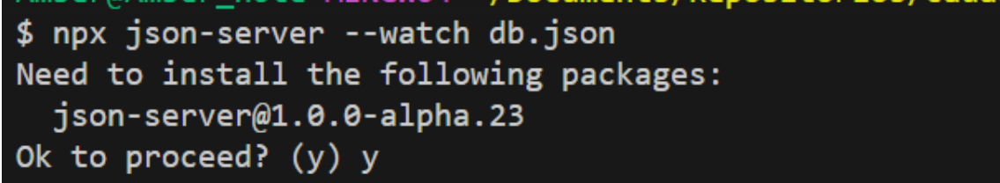

## Criando uma aplicação básica
1. Entre na pasta onde quer criar o projeto

2. Rode o comando ```ng new my-app --no-standalone --routing --ssr=false```
Ele cria uma nova aplicação não standalone no Angular 17, já configura o arquivo de rotas da aplicação e desativa o suporte a Server-Side Rendering (SSR) que é uma técnica em que as páginas da web são renderizadas no servidor antes de serem enviadas para o navegador.
Se quiser criar uma aplicação standalone no Angular 17 use o comando ```ng new my-app```

3. Vai aparecer a perguntando qual estilo você deseja usar, escolha com as setas direcionais e dê enter:
[](./img/aplicacao_angular_basica/escolher_estilo.png)

4. Depois se você não tiver  usado o parametro **--ssr**, vai perguntar se deseja trabalhar com renderização do lado do servidor, digite **y** ou **n** para respectivamente **sim** ou **não**:
[](./img/aplicacao_angular_basica/escolher_forma_renderizacao.png)

5. Vai aparecer em seguida informações como abaixo, basta esperar que finalize:
[](./img/aplicacao_angular_basica/logs_criando_aplicacao.png)

6. Agora que finalizou, acesse a pasta do seu projeto, que tem o mesmo nome que você informou para o projeto


7. Já dentro da pasta do projeto, é possível já levantar o servidor e visualizar a página padrão que é criada. Basta usar a linha de comando ```ng serve```. Com isso vai aparecer como abaixo, basta copiar o link ```http://localhost:4200/```  para visualizar a página:
[](./img/aplicacao_angular_basica/subindo_ng_serve.png)

8. A página vai parecer mais ou menos como abaixo:
[](./img/aplicacao_angular_basica/pagina_apos_subir.png)

### A estrutura de pastas
- O arquivo **package.json** é onde ficam as dependências do projeto.
- Os arquivos:
    - app.component.css
    - app.component.html
    - app.component.spec.ts
    - app.component.ts
    - app.config.ts
    - app.routes.ts  
São arquivos referentes à página principal da aplicação. É a partir dessa página que a aplicação será iniciada.
A pasta assets que é onde ficam arquivos estáticos como imagens.


Se ao subir sua aplicação pela primeira vez ocorrer o erro como abaixo:

[](./img/aplicacao_angular_basica/erro_primeira_subida.png)

Abra o arquivo indicado nos dois logs, que é o mesmo arquivo, e substitua a linha comentada pela linha logo abaixo dela conforma a imagem que segue:

[](./img/aplicacao_angular_basica/interface_com_erro.png)

```
…
export type SnapshotAction<T> = AngularFireAction<DatabaseSnapshot<T>>;
export type Primitive = number | string | boolean;
export interface DatabaseSnapshotExists<T> extends firebase.database.DataSnapshot {
    exists(): true;
    val(): T;
    //forEach(action: (a: DatabaseSnapshot<T>) => boolean): boolean;
    forEach(action: (a: firebase.database.DataSnapshot & { key: string }) => boolean | void): boolean;
}
export interface DatabaseSnapshotDoesNotExist<T> extends firebase.database.DataSnapshot {
    exists(): false;
    val(): null;
    //forEach(action: (a: DatabaseSnapshot<T>) => boolean): boolean;
    forEach(action: (a: firebase.database.DataSnapshot & { key: string }) => boolean | void): boolean;
}
…
```


---


## Criando componentes
Em Angular, as partes das páginas como cabeçalhos, menus, bodies, rodapés, etc são criados cada um em arquivos separados para reaproveitamento em outras páginas do projeto. Cada parte dessas é chamada de componente.
Para criar um componente, estando dentro da pasta raiz do projeto, podemos usar o comando ```ng generate component caminho_dos_componentes/nome_do_componente```  
ou a forma resumida
```ng g c caminho_dos_componentes/nome_do_componente```  

 Onde:
- **caminho_dos_componentes** é onde você quer que o arquivo seja criado. Se o caminho não existir, ele será criado.
- **Nome_do_componente** é o nome do componente  
Com isso, dentro da pasta app terá sido criado o caminho  caminho_dos_componentes contendo uma pasta com o nome informado para o componente e dentro desta terá os seguintes arquivos:
- **container.component.html** 
    - Onde tem o esqueleto HTML do seu componente
- **container.component.spec.ts**
- **container.component.ts**
    - Tem a parte lógica em Typescript do seu componente
- **Container.component.css**
    - Esse tem as classes css específicas do seu componente 

### Entendendo o arquivo **component.ts**
Quando um componente é criado como no passo descrito acima, é criada uma estrutura como a abaixo no arquivo nome_do_componente.component.ts:
```
import { Component } from '@angular/core';

@Component({
  selector: 'app-container',
  standalone: true,
  imports: [],
  templateUrl: './container.component.html',
  styleUrl: './container.component.css'
})
export class ContainerComponent {

}
```
Onde:
- **@Component** Esta é uma anotação decoradora em Angular que é usada para marcar uma classe como um componente. Ela aceita um objeto como argumento com metadados que descrevem o componente.


- **selector: 'app-container'**: É um seletor CSS usado para identificar o componente na marcação HTML. Assim, o componente pode ser usado na marcação HTML com ```<app-container></app-container>``` tal qual qualquer tag html ```(<div>, <span>, <p>, etc)```.


- **standalone**: true determina que um componente Angular pode ser utilizado de forma isolada, ou seja, sem depender de um NgModule. Ele é autocontido e não requer a declaração em um módulo para ser utilizado.


- **imports: []**: Esta é uma lista de módulos que este componente pode precisar. Neste caso, está vazio, o que significa que este componente não depende de nenhum outro módulo além dos padrões fornecidos pelo Angular.


- **templateUrl: './container.component.html'**: Este é o caminho para o arquivo HTML que contém o modelo (template) para este componente. No exemplo, o arquivo HTML está localizado no mesmo diretório que o arquivo TypeScript e é chamado container.component.html.


- **styleUrl: './container.component.css'**: Este é o caminho para o arquivo CSS que contém os estilos para este componente. No exemplo, o arquivo CSS está localizado no mesmo diretório que o arquivo TypeScript e é chamado container.component.css


- **export class ContainerComponent { }**: Aqui, estamos exportando uma classe TypeScript chamada ContainerComponent. Esta classe é a definição do componente em si e pode conter lógica adicional, manipulação de eventos, variáveis de classe, etc. Neste caso, a classe está vazia, mas ela pode ser expandida com funcionalidades conforme necessário para o componente.  

Para usar o componente criado, devemos importá-lo onde queremos usar. Por exemplo, se quisermos usar no componente principal (criado aqui), basta colocar dentro dos colchetes em imports como abaixo destacado em vermelho:

```
import { Component } from '@angular/core';
import { CommonModule } from '@angular/common';
import { RouterOutlet } from '@angular/router';
import { ContainerComponent } from './componentes/container/container.component';

@Component({
  selector: 'app-root',
  standalone: true,
  imports: [CommonModule, RouterOutlet, ContainerComponent],
  templateUrl: './app.component.html',
  styleUrl: './app.component.css'
})
export class AppComponent {
  title = 'indexa'
}
```
E no .html do componente pai, chama-lo como abaixo:  
 
    ```<app-container></app-container>```

---

## Diretiva @For
@for é usada para iterar sobre uma coleção de itens e renderizar um elemento HTML para cada item da coleção. Esta diretiva é útil quando você precisa exibir uma lista de itens dinamicamente.  
Exemplo:  

```
@for (nome of nomes; track nome) {
  <app-item [item]= nomes>
  </app-item>
}
```
Onde nomes é uma lista definida no arquivo **.ts** do componente em questão.

**@For** é uma evolução da diretiva ***ng-for**.

---

## Diretiva @if
**@if** é usada para renderizar ou não elementos HTML com base em uma expressão booleana. Essa diretiva é extremamente útil quando você deseja controlar a visibilidade de um elemento com base em uma condição.  
Exemplo:  
```
@if (clientForm.invalid) {
        <button class='btn btn-secondary' disabled>Enviar</button>
    }
    @else {
        <button type="submit" class='btn btn-primary'>Enviar</button>
    }
```
---

## Instalando Bootstrap com NPM
O primeiro passo é instalar o Bootstrap, jquery e o popper na aplicação rodando os comandos abaixo:  
```
npm install --save bootstrap
npm install --save bootstrap-icons
npm install --save @popperjs/core
```

Ou apenas:
```
npm install --save bootstrap bootstrap-icons @popperjs/core
```

Agora no arquivo angular.json você adiciona os arquivos do Bootstrap nos nós styles e scripts que ficam no caminho architect.build.options e que por padrão já existem, mas não contêm valores. Faça conforme abaixo. Você precisa colocar os arquivos na mesma ordem abaixo.

```
…
"architect": {
        "build": {
          "builder": "@angular-devkit/build-angular:application",
          "options": {
            "outputPath": "dist/cadastro_cliente",
            "index": "src/index.html",
            "browser": "src/main.ts",
            "polyfills": [
              "zone.js"
            ],
            "tsConfig": "tsconfig.app.json",
            "assets": [
              "src/favicon.ico",
              "src/assets"
            ],
            “styles”: [
"node_modules/bootstrap/scss/bootstrap.scss",
"node_modules/bootstrap-icons/font/bootstrap-icons.scss",
"src/styles/styles.scss"
],
            "scripts": [
"./node_modules/bootstrap/dist/js/bootstrap.min.js",
"./node_modules/@popperjs/core/dist/umd/popper.min.js"
]
…
```

---

## Definido propriedades para um componente
Existem duas formas de definir uma propriedade ao um componente. 
A primeira pode ser vista aqui, porém dessa primeira forma, não é possível alterar o valor da propriedade.
A segunda forma é usando o decorator **@Input** e nesta forma sim, permite que o valor da propriedade seja alterado. 
O decorator **@Input()**
Um decorador é uma função que modifica uma classe, um método ou uma propriedade antes que a classe seja instanciada ou o método/propriedade seja executado. 
 **@Input()** é um decorador (decorator) usado para permitir que os componentes recebam dados de entrada externamente. Esse decorador permite que um componente aceite dados de entrada de seu componente pai. Em outras palavras, **@Input()** é usado para criar uma propriedade no componente filho que pode ser passada por um componente pai quando o componente filho é usado em um modelo.
Quando você define uma propriedade em um componente filho usando **@Input()**, você está especificando que essa propriedade pode ser atribuída por um componente pai que use o componente filho em seu modelo.
Isto é definido no .ts referente ao componente em questão. Exemplo destacado em vermelho:
```
import { Component, Input } from '@angular/core';

@Component({
  selector: 'app-item',
  standalone: true,
  imports: [],
  templateUrl: './item.component.html',
  styleUrl: './item.component.css'
})
export class ItemComponent {
  @Input() item: string = "Maria Silva"
}
```

Outro exemplo em que o componente pai possui uma lista e ao renderizar os componentes filhos, cada item da lista será usado como valor para a propriedade definido no componente filho (Como feito aqui):
```
Arquivo .ts do componente pai:
import { ItemComponent } from './componentes/item/item.component';

@Component({
  selector: 'app-root',
  standalone: true,
  imports: [CommonModule, RouterOutlet, ContainerComponent, ItemComponent],
  templateUrl: './app.component.html',
  styleUrl: './app.component.css'
})
export class AppComponent {
  title = 'indexa';
  nomes = ["Arroz", "Feijão", "Carne"]
}
```
Onde nos itens destacados em vermelho na ordem em que aparecem:
- ItemComponent é o componente filho importado
- Itens = ["Arroz", "Feijão", "Carne"] É a lista que o componente pai 


Arquivo **.ts** do componente filho:
```
import { Component, Input } from '@angular/core';

@Component({
  selector: 'app-item',
  standalone: true,
  imports: [],
  templateUrl: './item.component.html',
  styleUrl: './item.component.css'
})
export class ItemComponent {
  @Input() item: string = “”
}
```
Onde:
- **@Input() item: string = “”** é onde definimos a propriedade item do componente filho

Arquivo **.html** do componente pai:
```
<app-container>
  <h1>Amber Lilith</h1>
</app-container>
@for (nome of nomes; track nome) {
  <app-item [item]= nome>
  </app-item>
}
```
Onde:
 - [item]= nome É onde o componente pai passa o valor para definir a propriedade item (definida aqui) do componente filho

---


## Two-way biding /ngModel
ngModel é uma diretiva do AngularJS que permite a vinculação bidirecional de dados entre o modelo JavaScript e os elementos do formulário HTML, permitindo que ao alterar o html (um input, select ou textarea) a variável correspondente seja alterada e vice-versa. 
Para usar basta no .html fazer referência a diretiva e a variável em questão dentro da tag referente ao elemento html (Veja linha destacada em vermelho):
```
<div class="container">
    <h1>Lista de compras</h1>
    <input type="text" [(ngModel)]="teste"/>
    <div>{{ teste }}</div> essa div só foi adicionada para visualizar a alteração feita na variável “teste” nos permitindo ver que ao alterar o input, o conteúdo do div (a varíavel por debaixo dos panos) é alterado simultaneamente.

    @for (item of listaDeItens; track item) {
        <div>
            <div class="row m-3 border-bottom">
                <div class="col-6">
                    {{item}}
                </div>
                <div class="col-1">
                    <button class="btn btn-danger">Excluir</button>
                </div>
                <div class="col-1">
                    <button class="btn btn-success">Editar</button>
                </div>
            </div>
            
                   </div>
 }
</div>
```

e no **.ts**, além de obviamente declarar a varíavel que vai guardar o valor, também importar a diretiva FormsModel (Veja linha destacada em vermelho):
```
import { Component, Input } from '@angular/core';
import { FormsModule } from '@angular/forms';

@Component({
  selector: 'app-item',
  standalone: true,
  imports: [FormsModule],
  templateUrl: './item.component.html',
  styleUrl: './item.component.css'
})
export class ItemComponent {
  @Input() item: string = ""
}


filtroPorTexto: string = “”

filtrarContatosPorTexto (): Contato [] {
    if (!this.filtroPorTexto) {
        return this.contatos
}
    return this.contatos.filter(contato => {
        return contato.nome.toLowerCase().includes (this.filtroPorTexto.toLowerCase())
    })
}

filtrarContatosPorLetraInicial (letra:string) : Contato[] {
    return this.filtrarContatosPorTexto().filter(contato => {
    return contato.nome.toLowerCase().startsWith(letra)
    } )
}
```

---

## Formulário Reativo (Orientado a dados)
Um formulário orientado a dados em Angular é uma abordagem na qual os dados do formulário são gerenciados por um modelo de dados subjacente na lógica do componente. Isso contrasta com a abordagem do **"Template-Driven Forms"** (Formulários orientados a modelo), onde o estado do formulário é controlado principalmente pelo próprio modelo HTML. No Angular, os formulários orientados a dados são implementados usando o módulo **ReactiveFormsModule**.  
Se for uma aplicação standalone, importar direto no componente, se for no standalone, importar no ```app.module.ts```.  

Para tornar o formulário reativo, siga os passos abaixo:
Crie o componente referente ao formulário  
Construa o template no arquivo .html referente ao formulário  
Exemplo:  
```
<form>
    <input type="text">
    <input type="tel">
    <input type="email">
</form>
```


No arquivo ```app.module.ts``` (Se for aplicação no standalone) ou no arquivo **.ts** do componente que representa o formulário (se for aplicação standalone) importe ReactiveFormsModule.


No arquivo **.ts** referente ao componente formulário:  
Inicialize uma variável do tipo **FormGroup**    
Implemente um construtor instanciando a variável acima e no construtor desse objeto, faça referência a cada item do seu formulário
Exemplo:  
```
import { Component } from '@angular/core';
import { FormControl, FormGroup, Validators } from '@angular/forms';
import { ClientService } from '../../services/client.service';
import { Router } from '@angular/router';
import { Client } from '../../model/Client';

@Component({
  selector: 'app-client-form',
  templateUrl: './client-form.component.html',
  styleUrl: './client-form.component.css'
})
export class ClientFormComponent {
  clientForm!: FormGroup
  client!: Client
  constructor(private clientService: ClientService, private router: Router){
    this.clientForm = new FormGroup({
      name: new FormControl("",Validators.required),
      phone: new FormControl("", Validators.required),
      email: new FormControl("", [Validators.required, Validators.email])
    })
  }

  saveClient(){    
    this.clientService.save(this.clientForm.value).subscribe()
  }  
}
```  
Retorne ao seu template no arquivo .html e faça referência ao objeto da classe FormGroup no form e em cada campo do formulário, faça referência a o item **FormControl** correspondente:
```
<form [formGroup]="clientForm">
    	<input type="text" formControlName="name">
    	<input type="tel"  formControlName="phone">
    	<input type="email"  formControlName="email">
</form>
```
Agora é só importar seu ```componente/formulário``` no **.ts** do componente que desejar.

---

## Enviando as informações do formulário (Event binding)
O event binding em é um mecanismo que permite que você responda a eventos do **DOM** (Document Object Model) gerados pelos elementos **HTML** em seu template, como cliques de mouse, pressionamentos de tecla, hover do mouse, etc. É uma forma de vinculação de dados unidirecional, onde você vincula um evento do template a um método no seu componente.  

Para atribuir uma função ao submeter o formulário basta adicionar **(ngSubmit)** na tag do formulário  (para atribuir uma função a qualquer elemento, o mecanismo é o mesmo, só muda o evento **(mouseOver)** **(click)** etc):
```
<form [formGroup]="clientForm" (ngSubmit)="sendInformations()">
    <input type="text" formControlName="name">
    <input type="tel"  formControlName="phone">
    <input type="email"  formControlName="email">
    <button type="submit">Enviar</button>
</form>
```
Onde ```sendInformations()``` é a função declarada no arquivo .ts que será chamada quando o formulário for chamado.

---

## Validando campos (Classe Validators)
A classe **Validators** fornece uma variedade de métodos estáticos que podem ser usados para impor regras específicas nos campos de um formulário reativo.  
Para usar, no arquivo **.ts** do componente do formulário, no construtor que define o **FormGroup** e na declaração de cada campo do formulário, acrescentamos a(s) validação(ões) desejada(s).
Lembrando que se for mais de um tipo de validação para um só campo, essas validações devem ser informadas entre colchetes. Veja exemplos abaixo:
```
import { Component } from '@angular/core';
import { FormControl, FormGroup, ReactiveFormsModule, Validators } from '@angular/forms';

@Component({
  selector: 'app-client-form',
  standalone: true,
  imports: [
    ReactiveFormsModule
  ],
  templateUrl: './client-form.component.html',
  styleUrl: './client-form.component.css'
})
export class ClientFormComponent {
  clientForm: FormGroup

  constructor(){
    this.clientForm = new FormGroup({
      name: new FormControl("Teste", Validators.required), /* Sempre ter o primeiro argumento nem que seja vazio. Ele se refere ao valor padrão para o campo */
      phone: new FormControl(),
      email: new FormControl(“”, [Validators.required, Validators.email]) /* Sempre entre colchetes se for mais de uma validação */
    })
  }

  sendInformations(){
    if(this.clientForm.valid){
      console.log(this.clientForm.value)
    }
  }

}
```
Também podemos ao invés de só enviar os dados se o formulário estiver válido, podemos usar algo mais visual que é manter o botão de envio do formulário desabilitado enquanto esse último estiver inválido:
```
@if (clientForm.invalid) {
        <button class='btn btn-secondary' disabled>Enviar</button>
    }
    @else {
        <button type="submit" class='btn btn-primary'>Enviar</button>
    }
```

---

## Mostrando mensagem de erro (Uso de @If)
É possível exibir uma div, por exemplo, abaixo do campo a ser validado caso esse campo esteja com valor(es) inválido(s).  
Exemplo:  
```
@if(clientForm.get('name')?.errors && clientForm.get("name")?.touched) {
    <div style="color: rgb(167, 11, 11);">
        Campo obrigatório
    </div>
    }
```
Onde:  
- name é o nome dado ao campo no arquivo **.ts**
- O trecho de código sublinhado, é para que a mensagem só apareça caso o usuário tenha entrado no campo e saído sem ter inserido um valor válido.   


É importante ter um **@if** para cada tipo de validação, caso contrário, pode causar confusão no usuário. Por exemplo, um campo de email, ele não pode ser nem vazio nem ter um formato diferente de email, porém, se as duas validações forem colocadas no mesmo **@If**, mesmo o campo estando com um valor qualquer diferente do formato de email, a mensagem não vai sumir nem vai ser possível enviar o formulário já que a primeira validação foi atendida, mas a segunda não. Exemplo de um **@If** para cada validação:
```
<input type="email" formControlName="email">
    @if(clientForm.get('email')?.errors?.['required'] && clientForm.get('email')?.touched) {
    <div style="color: rgb(167, 11, 11);">
        Campo obrigatório
    </div>
    }

    @if(clientForm.get('email')?.errors?.['email'] && clientForm.get("email")?.touched) {
    <div style="color: rgb(167, 11, 11);">
        Formato inválido para um email
    </div>
    }
```
Onde:  
- **'required'** é a validação definida ao iniciar o objeto clientForm no arquivo .ts
- **&& clientForm.get('email')?.touched e && clientForm.get("email")?.touched** é para evitar que assim que a pessoa abrir o formulário, todas essas mensagens já aparecerão. Dessa forma, só vai aparecer se o usuário entrar no campo e sair dele sem ter inserido um valor válido.

---

## Implementando rotas
Rotas, em termos de desenvolvimento web, referem-se à maneira pela qual o aplicativo web direciona o usuário para diferentes partes do aplicativo com base no URL ou em eventos específicos. Rotas são usadas para criar aplicativos de página única (**SPA - Single Page Applications**) e permitem que os desenvolvedores organizem o código em componentes reutilizáveis e definam como esses componentes são renderizados em diferentes URLs.  

Primeiro adicione a tag abaixo no **.html** do componente que vai ter as rotas (costuma ser o componente principal / **app.component.html**):

```
<router-outlet></router-outlet>
```
E no ```app.module.ts``` adicione o módulo **RouterOutlet**    

Quando é criada uma aplicação Angular não standalone, é criado junto a todos os arquivos os outros arquivos, o arquivo ```app-routing.module.ts```. É nele que configuramos as rotas da aplicação.  
Dentro dele há um objeto do tipo Routes que recebe uma lista de objetos. Cada objeto dessa lista representa uma rota da aplicação.  
Exemplo:  
```
import { Routes } from '@angular/router';

export const routes: Routes = [
  {
    path: 'formulario',
    component: FormularioContatoComponent
  }
];
```
Onde:  
- path: 'formulario' é o nome da rota
- component: FormularioContatoComponent é o componente que será carregado quando a rota for chamada  

Para redirecionar para um rota já existente, acrescentamos no objeto da lista mencionada acima, um parâmetro pathMatch. Ele pode receber o valor **full** e **prefix** sendo que:  

**Full** quer dizer que o roteador só corresponderá ao URL se ele corresponder exatamente ao caminho definido na rota e não tiver nada mais depois.  
**Prefix**  significa que o roteador irá corresponder ao URL se ele começar com o caminho definido na rota. Isso significa que o roteador corresponderá ao URL independentemente do que vem depois do caminho definido na rota.  
Exemplo:  
```
{
        path: "",
        component: 'formulario',
        pathMatch: "full"
    }
```
Quer dizer que ao chamar a url padrão da aplicação (no caso da aplicação subida local é ```http://localhost:4200```), irá redirecionar para a rota cujo nome é 'formulario'.

---

## Acessando as rotas criadas

Para conseguirmos acessar uma rota criada através de um elemento que seja um botão ou item de menu, por exemplo, devemos primeiro importar a classe RouterLink no componente que vai chamar a rota e em seguida  inserir como propriedade desse elemento a propriedade routerLink e como valor para ela informamos entre aspas o nome da rota.  
Exemplo:  
```
<section class="adicionar-contato">
    <button routerLink="/formulario">
      
      <span>Adicionar contato</span>
    </button>
  </section>
```  
Ou  
```
<section class="adicionar-contato">
    <button routerLink="[‘/formulario’]">
      
      <span>Adicionar contato</span>
    </button>
  </section>
```
Obs.: Não consegui criar um header não standalone com as opções de rotas. Ficava dando erro.

---

## Criando um servidor backend fake

Para criar um servidor backend fake podemos usar o **JSON Server** que é uma ferramenta simples que permite criar uma **API REST** fake (ou simulada) rapidamente com base em um arquivo **JSON**. Ele é extremamente útil durante o desenvolvimento de aplicativos, especialmente quando você precisa testar a integração com uma **API** real, mas a **API** real ainda não está disponível ou está em desenvolvimento.

Siga os passos abaixo:  

1. Crie uma pasta na raiz o projeto (Sugetão de nome: backend)

2. Navegue para dentro dessa pasta e rode o comando npm init -y.
É uma forma simplificada de inicializar um novo projeto npm (**Node.js**) sem a necessidade de responder a uma série de perguntas interativas.

3. Em seguida use o comando ```npm i json-server@0.17.4```

4. Agora dentro da pasta backend criamos um arquivo com nome **db.json**, que conterá todos os recursos (ou endpoints) da API.
Acrescente no arquivo db.json uma lista de objetos como no exemplo abaixo (Altere os objetos de acordo com sua necessidade desde que se tenha uma lista de objetos com os dados necessários): 
``` 
{
    "pensamentos": [
        {
            "id": 1,
            "conteudo": "Que bom que vc veio",
            "autoria": "Nay",
            "modelo": "modelo1"
        },
        {
            "id": 2,
            "conteudo": "Estudando Angular",
            "autoria": "Dev Alura",
            "modelo": "modelo2"
        },
        {
            "id": 3,
            "conteudo": "Angular é o melhor'",
            "autoria": "Dev Alura",
            "modelo": "modelo3"
        }
    ]
}
``` 

Acesse o arquivo package.json criado no passo 2 e na sessão script substitua o conteúdo  
``` 
"test": "echo \"Error: no test specified\" && exit 1"
```  
por  

``` 
"start": "json-server --watch db.json --port 3000"
``` 

Deverá ficar assim:  
``` 
{
  "name": "backend",
  "version": "1.0.0",
  "description": "",
  "main": "index.js",
  "scripts": {
    "start": "json-server --watch db.json --port 3000"
 },
  "keywords": [],
  "author": "",
  "license": "ISC",
  "dependencies": {
    "json-server": "^0.17.4"
  }
}
``` 
Dessa forma, é configurado o **JSON Server** para consultar o arquivo **db.json** e executar a API na porta 3000.  
Estando ainda dentro da pasta backend, após salvar todas as alterações feitas, de o comando npm start para subir o servidor.  
Obs.: Caso o comando npm start resulte no erro abaixo, use o comando ```npx json-server --watch db.json```. Ao rodar o comando, será feita a pergunta como no print abaixo, basta digitar y e dar enter:

[](./img/aplicacao_angular_basica/confirmar_instalacao_json_server.png)

O terminal passará a carregar os recursos. A mensagem **"Hi!"** aparecerá e também será possível ver o nosso recurso ou endpoint na seção "**Resources**". Se jogar o endpoint no navegador será possível visualizar o json contido no arquivo **db.json**.


---

## Consumindo API

O primeiro passo é manter a boa prática separando as responsabilidades criando uma service que irá chamar os métodos HTTP da API.  
Com o comando ```ng g s caminho/nomeDaService```, criamos uma service e no construtor dela, injetamos a classe HttpClient que será usada para invocar os métodos http (get, post, delete, etc):  
```
import { HttpClient } from '@angular/common/http';
import { Injectable } from '@angular/core';

@Injectable({
  providedIn: 'root'
})
export class ClientServiceService {

  constructor(private http: HttpClient) { }
}
```

Para conseguir usar **HttpClient** é preciso importar o seu módulo. Acessaremos o arquivo **app.module.ts** (se for aplicação no standalone) e importe na lista **imports:[]** a dependência **HttpClientModule**, Se for standalone, vá no arquivo **app.config.ts** e adicionei no array providers a linha  **provideHttpClient()**:
```
import { ApplicationConfig } from '@angular/core';
import { provideRouter } from '@angular/router';

import { routes } from './app.routes';
import { provideHttpClient } from '@angular/common/http';

export const appConfig: ApplicationConfig = {
  providers: [provideRouter(routes),
    provideHttpClient()]
};
```
Exemplos de métodos que podem ser implementados dentro da classe service para consultar a API:


- ### Create/Post
  - #### Código da service
    - ```js
      save(client: Client): Observable<Client>{
      return this.httpClient.post<Client>(this.API, client)
      }
      ```
  - #### Código do componente que chama o método da service
    - ```js
      save(){
      return this.service.save(this.clientForm.value)
      .subscribe(client =>{
      this.clientForm.reset()this.router.navigate(['/listar'])
      })
      }
      ```

- ### Delete/Delete
  - #### Código da service
    - ```js
      delete(id: number): Observable<void> {
      return this.httpClient.delete<void>(`${this.API}/${id}`);
      }
      ```
  - #### Código do componente que chama o método da service
    - ```js
      delete(id: number): void {
      this.service.delete(id).subscribe(() => {
      console.log(`Cliente com ID ${id} excluído com sucesso.`);
      /* Codigo abaixo é algo a ser feito após exclusão com sucesso
       como atualizar a lista de clientes após a exclusão ou redirecionar para outra tela*/
      this.list()
      }, (error) => {
      console.error('Erro ao excluir cliente:', error);
      });
      }
      ```

- ### Update/Put
  - #### Código da service
    - ```js
      update(id: string, client: Client): Observable<any> {
      return this.httpClient.put<any>(`${this.API}/${id}`, client);
      }
      ```
  - #### Código do componente que chama o método da service
    - ```js
      update() {
      this.service.update(this.clientIdToEdit, this.clientForm.value)
      .subscribe(
        response => {
          console.log('Dados atualizados com sucesso:', response);
          this.router.navigate(['/listar'])
        },
        error => {
          console.error('Erro ao atualizar dados:', error);
          // Lide com o erro de alguma forma, se necessário
        }
      );
      }
      ```

- ### ListAll/Get
  - #### Código da service
    - ```js
      list(): Observable<Client[]> {
      return this.httpClient.get<Client[]>(this.API)
      }
      ```
  - #### Código do componente que chama o método da service
    - ```js
      list():void{
      this.service.list().subscribe(clientList =>{
      this.clientList = clientList
      })
      }
      ```

- ### GetOne/Get
  - #### Código da service
    - ```js
      getOneClient(id: number): Observable<any> {
      return this.httpClient.get(`${this.API}/${id}`).pipe(
      catchError(error => {
      console.error('Erro ao obter registro:', error);
        return throwError(() => new Error('Não foi possível recuperar o registro!'))
        })
      );
      }
      ```
  - #### Código do componente que chama o método da service
    - ```js
      getOneClient(id: number): void {
        this.clientService.getOneClient(id).subscribe(
          (response) => {
            console.log(response)
          },
          (error) => {
            // Lógica para lidar com o erro ao obter o registro
            console.error('Erro ao obter registro:', error);
          }
        );
      }
      ```

---

## Redirecionando para uma rota
No componente injete um Router no construtor e onde quiser redirecionar chame ```this.router.navigate(['/caminhoDaRota'])```
como no código abaixo:
```js
@Component({
  selector: 'app-client-form',
  standalone: true,
  imports: [CommonModule, ReactiveFormsModule],
  templateUrl: './client-form.component.html',
  styleUrl: './client-form.component.css'
})
export class ClientFormComponent {
  clientForm: FormGroup

  constructor(private service: ClientServiceService, private router: Router){
    this.clientForm = new FormGroup({
      name: new FormControl("",Validators.required),
      phone: new FormControl("", Validators.required),
      email: new FormControl("", [Validators.required, Validators.email])
    })
  }

  saveClient(){
    if(this.clientForm.valid){
      this.service.save(this.clientForm.value).subscribe(() =>{
        this.router.navigate(['/listar'])
      })

    }
  }

}
```
---

## Passando vários parâmetros para um rota

Para passar vários parâmetros para uma rota em Angular, você pode incluí-los na definição da rota e também ao navegar para essa rota. Aqui está como você pode fazer:  

1. Defina os parâmetros no item path:  
```js
import { Routes } from '@angular/router';
import { ClientFormComponent } from './components/client-form/client-form.component';
import { ListClientComponent } from './components/list-client/list-client.component';

export const routes: Routes = [
    {
        component: ClientFormComponent,
        path: "formulario/:type/:id"
    },
    ];
```
Onde para cada parâmetro, você dá um ```/:nomeDoParametro``` (Barra, dois pontos e o nome do parâmetro)


2. No componente que contém o link para a rota com vários parâmetros,no arquivo .ts importe RouterLink e no aquivo .html crie o link com esses parâmetros:
```html
<button class="btn btn-primary" [routerLink]="['/formulario',’edit’,2]">Editar</button>
```

3. No componente para o qual a rota está apontando, você pode acessar esses parâmetros da rota usando o serviço **ActivatedRoute**:

```js
@Component({
  selector: 'app-client-form',
  standalone: true,
  imports: [
    CommonModule
  ],
  templateUrl: './client-form.component.html',
  styleUrl: './client-form.component.css'
})
export class ClientFormComponent {
  
  constructor( private route: ActivatedRoute,private router: Router){ }

 // … outros códigos

  ngOnInit(): void {
    this.clientIdToEdit = this.route.snapshot.paramMap.get('id');   
   
  }

// … outros códigos 
  
}
```

Dessa forma, quando você navegar para a rota com esses parâmetros, eles serão passados para o componente correspondente e podem ser acessados lá usando o serviço **ActivatedRoute**. 


