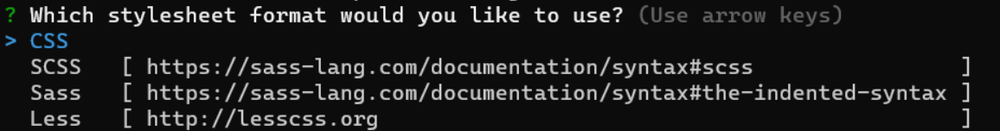
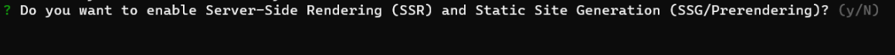
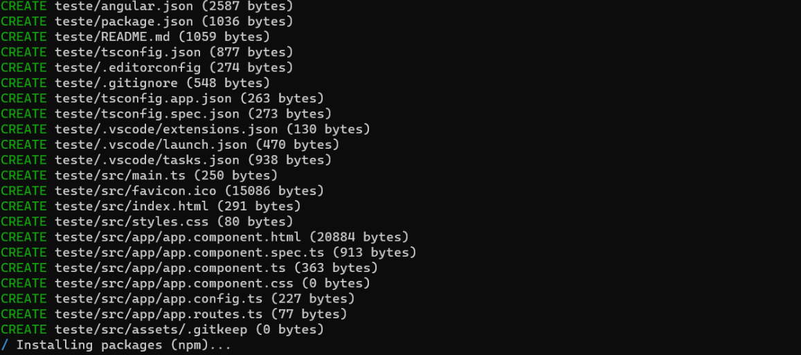
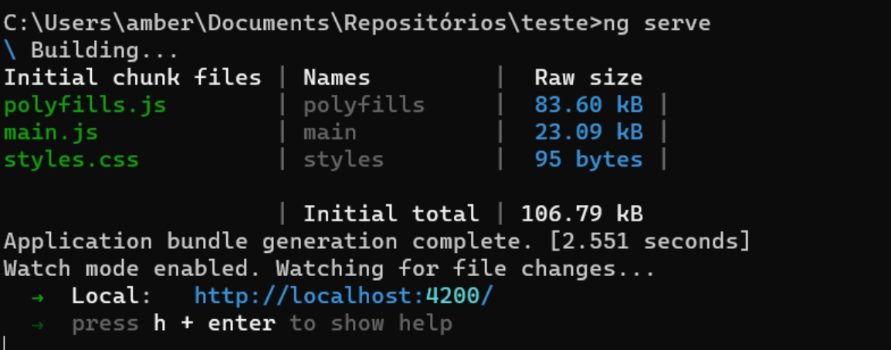
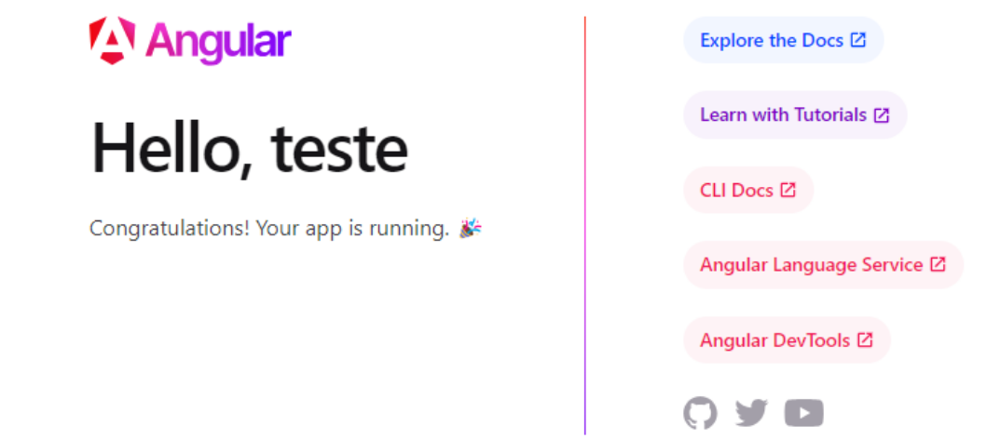
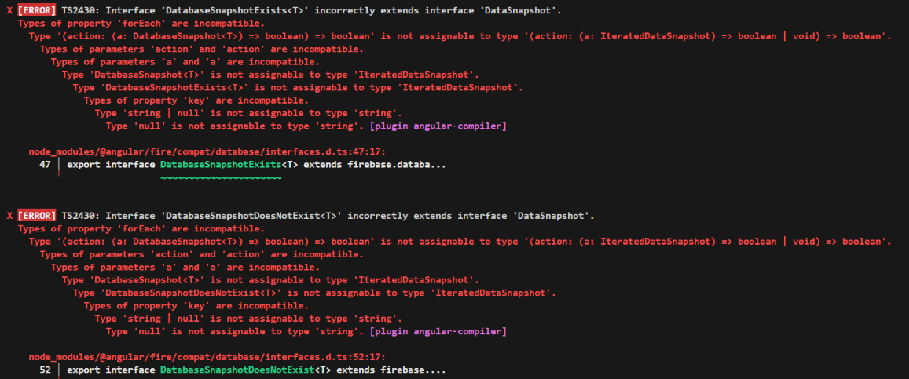
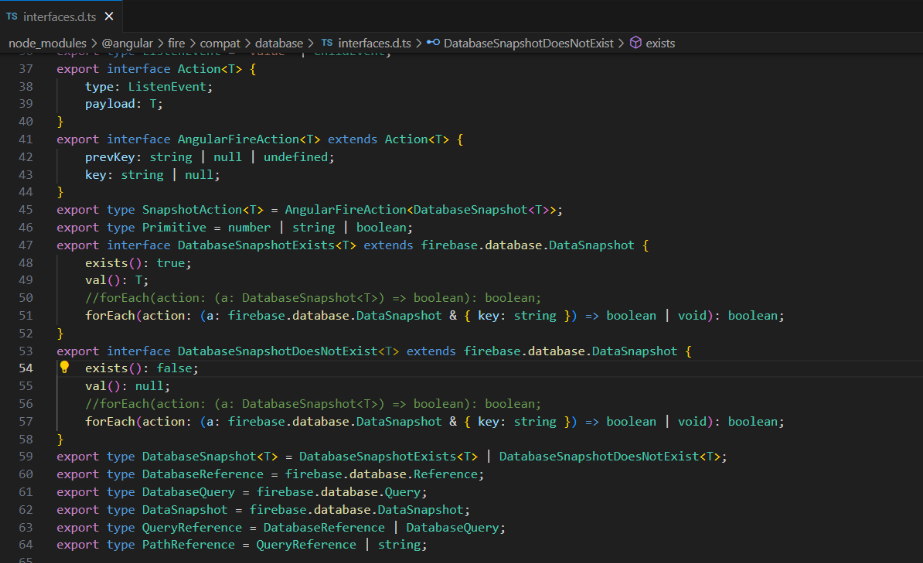

## Criando uma aplicação básica
1. Entre na pasta onde quer criar o projeto

2. Rode o comando ```ng new my-app --no-standalone --routing --ssr=false```
Ele cria uma nova aplicação não standalone no Angular 17, já configura o arquivo de rotas da aplicação e desativa o suporte a Server-Side Rendering (SSR) que é uma técnica em que as páginas da web são renderizadas no servidor antes de serem enviadas para o navegador.
Se quiser criar uma aplicação standalone no Angular 17 use o comando ```ng new my-app```

3. Vai aparecer a perguntando qual estilo você deseja usar, escolha com as setas direcionais e dê enter:
[](./img/aplicacao_angular_basica/escolher_estilo.png)

4. Depois se você não tiver  usado o parametro **--ssr**, vai perguntar se deseja trabalhar com renderização do lado do servidor, digite **y** ou **n** para respectivamente **sim** ou **não**:
[](./img/aplicacao_angular_basica/escolher_forma_renderizacao.png)

5. Vai aparecer em seguida informações como abaixo, basta esperar que finalize:
[](./img/aplicacao_angular_basica/logs_criando_aplicacao.png)

6. Agora que finalizou, acesse a pasta do seu projeto, que tem o mesmo nome que você informou para o projeto


7. Já dentro da pasta do projeto, é possível já levantar o servidor e visualizar a página padrão que é criada. Basta usar a linha de comando ```ng serve```. Com isso vai aparecer como abaixo, basta copiar o link ```http://localhost:4200/```  para visualizar a página:
[](./img/aplicacao_angular_basica/subindo_ng_serve.png)

8. A página vai parecer mais ou menos como abaixo:
[](./img/aplicacao_angular_basica/pagina_apos_subir.png)

### A estrutura de pastas
- O arquivo **package.json** é onde ficam as dependências do projeto.
- Os arquivos:
    - app.component.css
    - app.component.html
    - app.component.spec.ts
    - app.component.ts
    - app.config.ts
    - app.routes.ts  
São arquivos referentes à página principal da aplicação. É a partir dessa página que a aplicação será iniciada.
A pasta assets que é onde ficam arquivos estáticos como imagens.


Se ao subir sua aplicação pela primeira vez ocorrer o erro como abaixo:

[](./img/aplicacao_angular_basica/erro_primeira_subida.png)

Abra o arquivo indicado nos dois logs, que é o mesmo arquivo, e substitua a linha comentada pela linha logo abaixo dela conforma a imagem que segue:

[](./img/aplicacao_angular_basica/interface_com_erro.png)

```
…
export type SnapshotAction<T> = AngularFireAction<DatabaseSnapshot<T>>;
export type Primitive = number | string | boolean;
export interface DatabaseSnapshotExists<T> extends firebase.database.DataSnapshot {
    exists(): true;
    val(): T;
    //forEach(action: (a: DatabaseSnapshot<T>) => boolean): boolean;
    forEach(action: (a: firebase.database.DataSnapshot & { key: string }) => boolean | void): boolean;
}
export interface DatabaseSnapshotDoesNotExist<T> extends firebase.database.DataSnapshot {
    exists(): false;
    val(): null;
    //forEach(action: (a: DatabaseSnapshot<T>) => boolean): boolean;
    forEach(action: (a: firebase.database.DataSnapshot & { key: string }) => boolean | void): boolean;
}
…
```


---


## Criando componentes
Em Angular, as partes das páginas como cabeçalhos, menus, bodies, rodapés, etc são criados cada um em arquivos separados para reaproveitamento em outras páginas do projeto. Cada parte dessas é chamada de componente.
Para criar um componente, estando dentro da pasta raiz do projeto, podemos usar o comando ```ng generate component caminho_dos_componentes/nome_do_componente```  
ou a forma resumida
```ng g c caminho_dos_componentes/nome_do_componente```  

 Onde:
- **caminho_dos_componentes** é onde você quer que o arquivo seja criado. Se o caminho não existir, ele será criado.
- **Nome_do_componente** é o nome do componente  
Com isso, dentro da pasta app terá sido criado o caminho  caminho_dos_componentes contendo uma pasta com o nome informado para o componente e dentro desta terá os seguintes arquivos:
- **container.component.html** 
    - Onde tem o esqueleto HTML do seu componente
- **container.component.spec.ts**
- **container.component.ts**
    - Tem a parte lógica em Typescript do seu componente
- **Container.component.css**
    - Esse tem as classes css específicas do seu componente 

### Entendendo o arquivo **component.ts**
Quando um componente é criado como no passo descrito acima, é criada uma estrutura como a abaixo no arquivo nome_do_componente.component.ts:
```
import { Component } from '@angular/core';

@Component({
  selector: 'app-container',
  standalone: true,
  imports: [],
  templateUrl: './container.component.html',
  styleUrl: './container.component.css'
})
export class ContainerComponent {

}
```
Onde:
- **@Component** Esta é uma anotação decoradora em Angular que é usada para marcar uma classe como um componente. Ela aceita um objeto como argumento com metadados que descrevem o componente.


- **selector: 'app-container'**: É um seletor CSS usado para identificar o componente na marcação HTML. Assim, o componente pode ser usado na marcação HTML com ```<app-container></app-container>``` tal qual qualquer tag html ```(<div>, <span>, <p>, etc)```.


- **standalone**: true determina que um componente Angular pode ser utilizado de forma isolada, ou seja, sem depender de um NgModule. Ele é autocontido e não requer a declaração em um módulo para ser utilizado.


- **imports: []**: Esta é uma lista de módulos que este componente pode precisar. Neste caso, está vazio, o que significa que este componente não depende de nenhum outro módulo além dos padrões fornecidos pelo Angular.


- **templateUrl: './container.component.html'**: Este é o caminho para o arquivo HTML que contém o modelo (template) para este componente. No exemplo, o arquivo HTML está localizado no mesmo diretório que o arquivo TypeScript e é chamado container.component.html.


- **styleUrl: './container.component.css'**: Este é o caminho para o arquivo CSS que contém os estilos para este componente. No exemplo, o arquivo CSS está localizado no mesmo diretório que o arquivo TypeScript e é chamado container.component.css


- **export class ContainerComponent { }**: Aqui, estamos exportando uma classe TypeScript chamada ContainerComponent. Esta classe é a definição do componente em si e pode conter lógica adicional, manipulação de eventos, variáveis de classe, etc. Neste caso, a classe está vazia, mas ela pode ser expandida com funcionalidades conforme necessário para o componente.  

Para usar o componente criado, devemos importá-lo onde queremos usar. Por exemplo, se quisermos usar no componente principal (criado aqui), basta colocar dentro dos colchetes em imports como abaixo destacado em vermelho:

```
import { Component } from '@angular/core';
import { CommonModule } from '@angular/common';
import { RouterOutlet } from '@angular/router';
import { ContainerComponent } from './componentes/container/container.component';

@Component({
  selector: 'app-root',
  standalone: true,
  imports: [CommonModule, RouterOutlet, ContainerComponent],
  templateUrl: './app.component.html',
  styleUrl: './app.component.css'
})
export class AppComponent {
  title = 'indexa'
}
```
E no .html do componente pai, chama-lo como abaixo:  
 
    ```<app-container></app-container>```

---

## Diretiva @For
@for é usada para iterar sobre uma coleção de itens e renderizar um elemento HTML para cada item da coleção. Esta diretiva é útil quando você precisa exibir uma lista de itens dinamicamente.  
Exemplo:  

```
@for (nome of nomes; track nome) {
  <app-item [item]= nomes>
  </app-item>
}
```
Onde nomes é uma lista definida no arquivo **.ts** do componente em questão.

**@For** é uma evolução da diretiva ***ng-for**.

---

## Diretiva @if
**@if** é usada para renderizar ou não elementos HTML com base em uma expressão booleana. Essa diretiva é extremamente útil quando você deseja controlar a visibilidade de um elemento com base em uma condição.  
Exemplo:  
```
@if (clientForm.invalid) {
        <button class='btn btn-secondary' disabled>Enviar</button>
    }
    @else {
        <button type="submit" class='btn btn-primary'>Enviar</button>
    }
```
---

## Instalando Bootstrap com NPM
O primeiro passo é instalar o Bootstrap, jquery e o popper na aplicação rodando os comandos abaixo:  
```
npm install --save bootstrap
npm install --save bootstrap-icons
npm install --save @popperjs/core
```

Ou apenas:
```
npm install --save bootstrap bootstrap-icons @popperjs/core
```

Agora no arquivo angular.json você adiciona os arquivos do Bootstrap nos nós styles e scripts que ficam no caminho architect.build.options e que por padrão já existem, mas não contêm valores. Faça conforme abaixo. Você precisa colocar os arquivos na mesma ordem abaixo.

```
…
"architect": {
        "build": {
          "builder": "@angular-devkit/build-angular:application",
          "options": {
            "outputPath": "dist/cadastro_cliente",
            "index": "src/index.html",
            "browser": "src/main.ts",
            "polyfills": [
              "zone.js"
            ],
            "tsConfig": "tsconfig.app.json",
            "assets": [
              "src/favicon.ico",
              "src/assets"
            ],
            “styles”: [
"node_modules/bootstrap/scss/bootstrap.scss",
"node_modules/bootstrap-icons/font/bootstrap-icons.scss",
"src/styles/styles.scss"
],
            "scripts": [
"./node_modules/bootstrap/dist/js/bootstrap.min.js",
"./node_modules/@popperjs/core/dist/umd/popper.min.js"
]
…
```

---

## Definido propriedades para um componente
Existem duas formas de definir uma propriedade ao um componente. 
A primeira pode ser vista aqui, porém dessa primeira forma, não é possível alterar o valor da propriedade.
A segunda forma é usando o decorator **@Input** e nesta forma sim, permite que o valor da propriedade seja alterado. 
O decorator **@Input()**
Um decorador é uma função que modifica uma classe, um método ou uma propriedade antes que a classe seja instanciada ou o método/propriedade seja executado. 
 **@Input()** é um decorador (decorator) usado para permitir que os componentes recebam dados de entrada externamente. Esse decorador permite que um componente aceite dados de entrada de seu componente pai. Em outras palavras, **@Input()** é usado para criar uma propriedade no componente filho que pode ser passada por um componente pai quando o componente filho é usado em um modelo.
Quando você define uma propriedade em um componente filho usando **@Input()**, você está especificando que essa propriedade pode ser atribuída por um componente pai que use o componente filho em seu modelo.
Isto é definido no .ts referente ao componente em questão. Exemplo destacado em vermelho:
```
import { Component, Input } from '@angular/core';

@Component({
  selector: 'app-item',
  standalone: true,
  imports: [],
  templateUrl: './item.component.html',
  styleUrl: './item.component.css'
})
export class ItemComponent {
  @Input() item: string = "Maria Silva"
}
```

Outro exemplo em que o componente pai possui uma lista e ao renderizar os componentes filhos, cada item da lista será usado como valor para a propriedade definido no componente filho (Como feito aqui):
```
Arquivo .ts do componente pai:
import { ItemComponent } from './componentes/item/item.component';

@Component({
  selector: 'app-root',
  standalone: true,
  imports: [CommonModule, RouterOutlet, ContainerComponent, ItemComponent],
  templateUrl: './app.component.html',
  styleUrl: './app.component.css'
})
export class AppComponent {
  title = 'indexa';
  nomes = ["Arroz", "Feijão", "Carne"]
}
```
Onde nos itens destacados em vermelho na ordem em que aparecem:
- ItemComponent é o componente filho importado
- Itens = ["Arroz", "Feijão", "Carne"] É a lista que o componente pai 


Arquivo **.ts** do componente filho:
```
import { Component, Input } from '@angular/core';

@Component({
  selector: 'app-item',
  standalone: true,
  imports: [],
  templateUrl: './item.component.html',
  styleUrl: './item.component.css'
})
export class ItemComponent {
  @Input() item: string = “”
}
```
Onde:
- **@Input() item: string = “”** é onde definimos a propriedade item do componente filho

Arquivo **.html** do componente pai:
```
<app-container>
  <h1>Amber Lilith</h1>
</app-container>
@for (nome of nomes; track nome) {
  <app-item [item]= nome>
  </app-item>
}
```
Onde:
 - [item]= nome É onde o componente pai passa o valor para definir a propriedade item (definida aqui) do componente filho

---


## Two-way biding /ngModel
ngModel é uma diretiva do AngularJS que permite a vinculação bidirecional de dados entre o modelo JavaScript e os elementos do formulário HTML, permitindo que ao alterar o html (um input, select ou textarea) a variável correspondente seja alterada e vice-versa. 
Para usar basta no .html fazer referência a diretiva e a variável em questão dentro da tag referente ao elemento html (Veja linha destacada em vermelho):
```
<div class="container">
    <h1>Lista de compras</h1>
    <input type="text" [(ngModel)]="teste"/>
    <div>{{ teste }}</div> essa div só foi adicionada para visualizar a alteração feita na variável “teste” nos permitindo ver que ao alterar o input, o conteúdo do div (a varíavel por debaixo dos panos) é alterado simultaneamente.

    @for (item of listaDeItens; track item) {
        <div>
            <div class="row m-3 border-bottom">
                <div class="col-6">
                    {{item}}
                </div>
                <div class="col-1">
                    <button class="btn btn-danger">Excluir</button>
                </div>
                <div class="col-1">
                    <button class="btn btn-success">Editar</button>
                </div>
            </div>
            
                   </div>
 }
</div>
```

e no **.ts**, além de obviamente declarar a varíavel que vai guardar o valor, também importar a diretiva FormsModel (Veja linha destacada em vermelho):
```
import { Component, Input } from '@angular/core';
import { FormsModule } from '@angular/forms';

@Component({
  selector: 'app-item',
  standalone: true,
  imports: [FormsModule],
  templateUrl: './item.component.html',
  styleUrl: './item.component.css'
})
export class ItemComponent {
  @Input() item: string = ""
}


filtroPorTexto: string = “”

filtrarContatosPorTexto (): Contato [] {
    if (!this.filtroPorTexto) {
        return this.contatos
}
    return this.contatos.filter(contato => {
        return contato.nome.toLowerCase().includes (this.filtroPorTexto.toLowerCase())
    })
}

filtrarContatosPorLetraInicial (letra:string) : Contato[] {
    return this.filtrarContatosPorTexto().filter(contato => {
    return contato.nome.toLowerCase().startsWith(letra)
    } )
}
```
