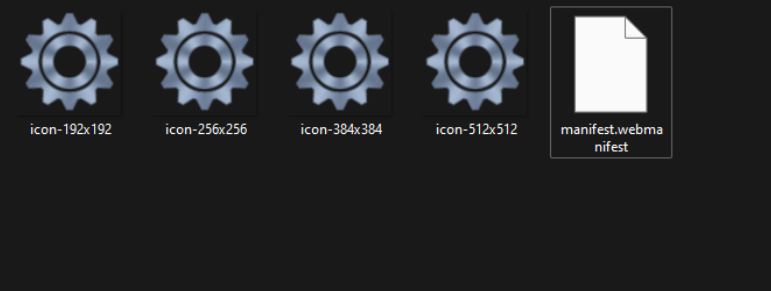
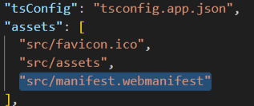
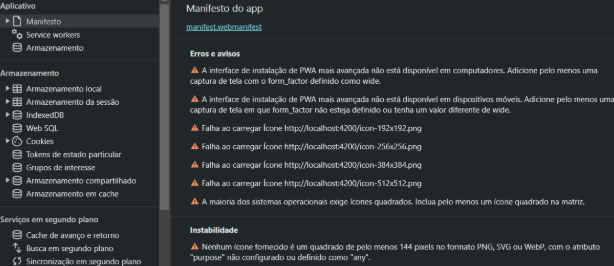

# Configurando Progressive Web App
PWA ou Progressive Web App significa um aplicativo de web progressivo. É um aplicativo desenvolvido a partir de tecnologias da web que todos nós conhecemos e gostamos, como HTML, CSS e JavaScript, mas com a sensação e funcionalidade que fica bem próxima de um aplicativo nativo de fato. O que possibilita ter uma “aplicação mobile” que roda tanto em Android quanto IOS.


Primeira coisa é certificar se de que o arquivo que representa a página inicial da aplicação tenha o nome index.html.

Depois crie as dependências necessárias usando um dos sites abaixo:

https://app-manifest.firebaseapp.com/

https://progressier.com/pwa-manifest-generator

https://www.infyways.com/tools/web-manifest-generator/


Neles você vai passar as informações da sua aplicação bem como o ícone da mesma:

Nos campos **Name** e **Short** Name você pode informar o nome da sua aplicação.

No campo Display escolha FullScreen.

Nos campos **Application Scope** e **Start URL**, informe ./ (ponto e barra).
Isso significa que você está informando a pasta mãe da pasta que vai ficar seu arquivo **manifest.webmanifest** que é um dos arquivos que serão gerados quando você clicar no botão **GENERATE MANIFEST**.

Em **Icons**, faça upload do ícone da sua aplicação na resolução 512 x 512. Assim, a plataforma irá criar as cópias com resoluções menores. 
Quando clicar no botão **GENERATE MANIFEST**, será gerada uma pasta compactada com o nome manifest contendo os arquivos abaixo:

[](./img/configurando_PWA/conteudo_pasta_manifest.png)


Dentro do **manifest.webmanifest** terá um conteúdo parecido com o abaixo:

[](./img/configurando_PWA/conteudo_manifest.webmanifest.png)


Depois de descompactar a pasta baixada, salve o arquivo **manifest.webmanifest** dentro de src e as imagens em **src/assets/icons**.

Em seguida, altere no arquivo **manifest.webmanifest** o caminho src de cada imagem para **assets/icons/nomeDaImagem.png** 

Agora abra o arquivo **angular.json** e procure pela parte abaixo e acrescente a linha selecionada como mostrado na imagem:

[](./img/configurando_PWA/alteracao_angular_json.png)

Vá no arquivo **index.html** e acrescente a tag abaixo dentro da tag head:
```
<link rel="manifest" href="manifest.webmanifest">
```

Ao subir sua aplicação localmente com ng serve, já será possível ao debugar pelo navegador (No Chrome use o atalho Control + Shift + i) e navegue até a aba application ou aplicativo, na opção Manifest ou Manifesto deve aparecer parecido ao exemplo abaixo:

[](./img/configurando_PWA/confirmando_ao_debugar.png)