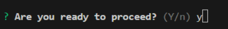
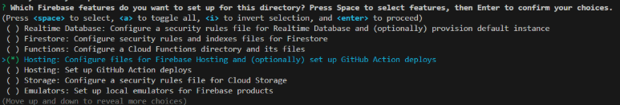
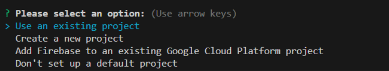
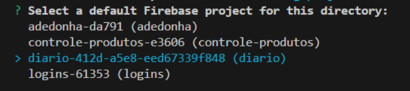
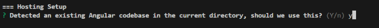
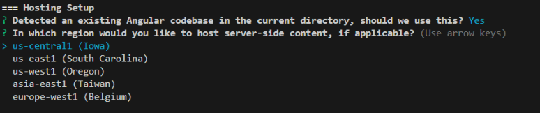
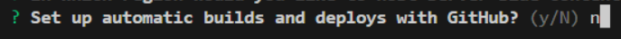
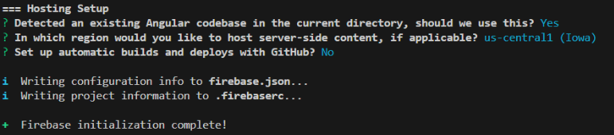
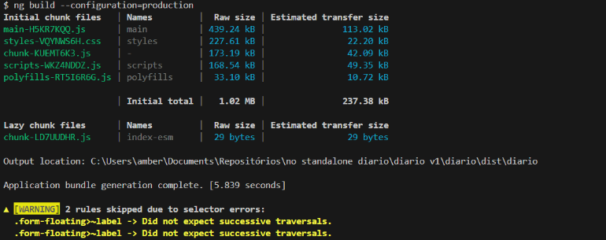
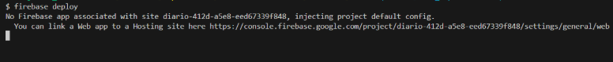

1. ## Altere arquivo angular.json

   Se os passos de 1 a 5 já foram realizados, basta efetuar os passos [Dê build na aplicação](#5-dê-build-na-aplicação) e 
[Inicie o deploy](#6-inicie-o-deploy)

   Se ainda não tiver feito, primeiro altere o arquivo angular.json e exclua todo o conteúdo do item budgets como abaixo deixando só []:
    ```
      "configurations": {
                  "production": {
                    "budgets": [
                      {
                        "type": "initial",
                        "maximumWarning": "500kb",
                        "maximumError": "1mb"
                      },
                      {
                        "type": "anyComponentStyle",
                        "maximumWarning": "2kb",
                        "maximumError": "4kb"
                      }
                    ],
      ```

## 1. Stack e decisões de arquitetura

## 1. Inicie o firebase 

   Insira o comando abaixo no terminal:
   ```
   firebase init
   ```
    Irá aparecer como abaixo, digite Y e dê enter:

    [](./img/deploy_firebase_hosting/firebase_init.png)

2. ## Selecione a feature

   Agora selecione a feature **"Hosting: Configure files for Firebase Hosting and (optionally) set up GitHub Action deploys"** como monstrado abaixo:
   
   [](./img/deploy_firebase_hosting/selecionando_feature.png)

3. ## Selecionando o projeto

   1. Primeiro escolha **Use an existing project**

      [](./img/deploy_firebase_hosting/selecionar_projeto.png)

   2. Depois o nome do projeto (No caso desse projeto é o **diario-412d-a5e8-eed67339f848**)

      [](./img/deploy_firebase_hosting/selecionar_projeto_2.png)
   
4. ## Configuração do Hosting

   1. Como na imagem abaixo, digite Y e dê enter:

      [](./img/deploy_firebase_hosting/hosting_setup.png)

   2. Agora escolha Us-central1 como na próxima imagem:

      [](./img/deploy_firebase_hosting/hosting_setup_2.png)

   3. Escolha N (Não) para deploy e build automático via Github:

      [](./img/deploy_firebase_hosting/setup_github.png)

   Por fim serão mostradas as informações como abaixo:

   [](./img/deploy_firebase_hosting/hosting_setup_confirmacao.png)

## 5. Dê build na aplicação

   Use o com o comando ```ng build --configuration=production```:

   [](./img/deploy_firebase_hosting/build_production.png)

## 6. Inicie o deploy 

   Agora use o comando ```firebase deploy```

Vai aparecer a mensagem abaixo. 
Nâo se preocupe, ele mesmo vai ficar pensando um pouquinho e vai dar prosseguimento logo em seguida:

[](./img/deploy_firebase_hosting/ultima_mensagem.png)
