# Conectando com Firebase usando AngularFire

Esse documento foi confeccionado em 30/03/2024 e até então havia pouca documentação de como implementar o Firebase em aplicações puramente standalone, então esse documento é baseado em uma aplicação no standalone.
Destaque para a dificuldade que tive de encontrar uma documentação que desse certo do começo ao fim.

## Instalando e configurando AngularFire

 Para instalar as dependências do Firebase usando a biblioteca Angular Fire, use o comando abaixo:

```ng add @angular/fire```

Será iniciada a instalação e em algum momento, será perguntado qual feature deseja instalar,selecione a opção desejada com a tecla espaço e de enter:

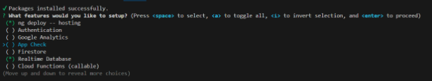

Em seguida será questionada qual conta google deseja usar para se conectar ao Firebase:

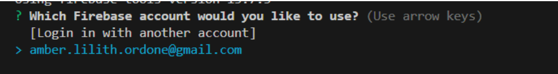

Depois qual projeto:

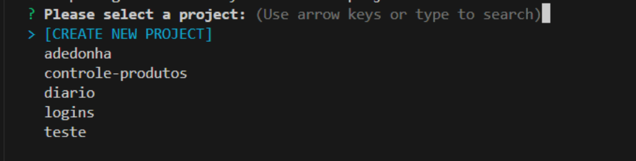

Depois qual hosting:

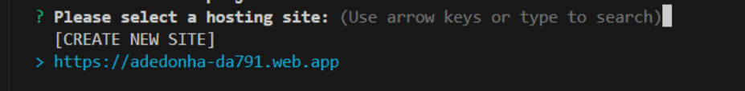

Em seguida escolher qual app:

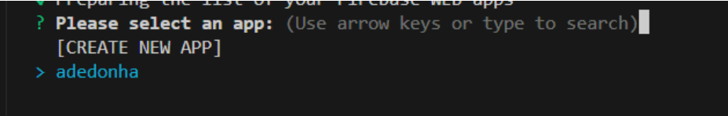

Ao final, a própria biblioteca AngulaFire vai adicionar a dependencia abaixo no seu arquivo app.module.ts:

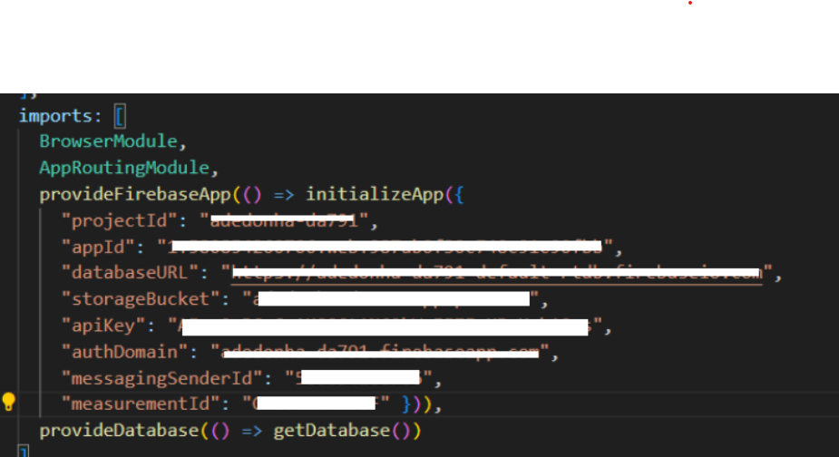

Como a documentação do AngularFire é muito lixo, não consegui usar a dependencia mencionada acima. Acabei usando o que descrevo abaixo:

No @NgModule do arquivo app.module.ts, dentro da lista de imports importar AngularFireModule. Se ao inserir a classe AngularFireModule nos imports, se ela não for automaticamente importada, insira o importe manualmente com ```import \{ AngularFireModule \} from '@angular/fire/compat';```

imports: \[
    BrowserModule,
    AppRoutingModule,
    HttpClientModule,
    ReactiveFormsModule,
    AngularFireModule.initializeApp\(\{\},’nomeDaAplicacaoNoFirebase’\)

No lugar das chaves do método initializeApp, devem ir às informações da aplicação que a própria biblioteca puxou no passo acima, ou você também pode pegar na plataforma do firebase indo em configurações após selecionar o projeto em questão:

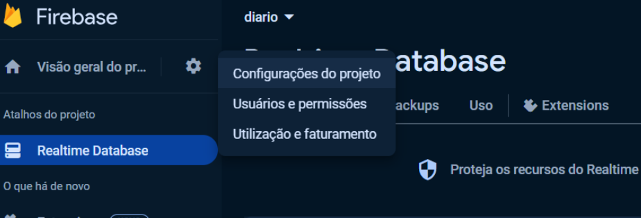

Na página que se abrir, na aba Geral, vá até o final da página e selecione a opção config:

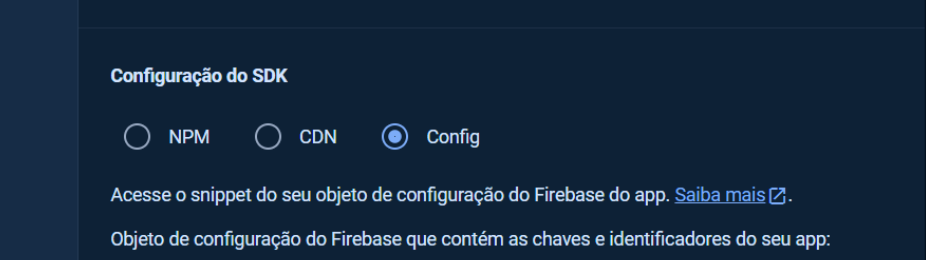

Isso irá exibir as informações contidas no texto em negrito:

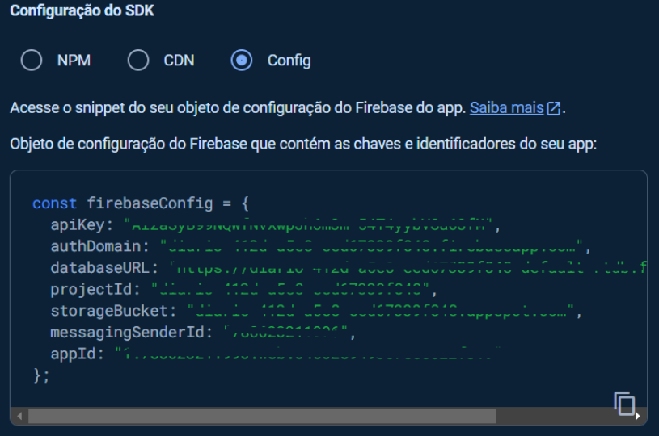

Caso não tenha nenhum aplicativo cadastrado, clique no botão Adicionar app:

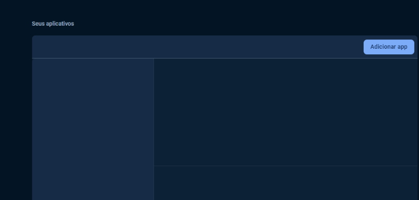

Na pop-up que aparecer, escolha a opção referente a aplicação web que é ```</> ``` \(na imagem abaixo, é a terceira opção\):

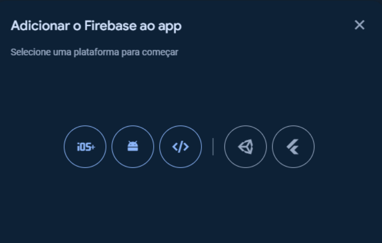

Na janela que se abrir, informe o nome do seu app e vá seguindo as outras opções até concluir:

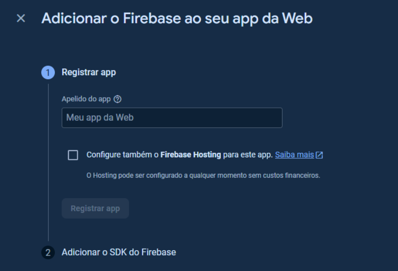

## Gerando arquivos environiments


É uma boa prática salvar as informações sensíveis do banco em um arquivo environment invés de informar direto no arquivo app.module.ts como feito acima. 
Nas novas versão do Angular, esses arquivos não são gerados automaticamente, então podemo usar o código abaixo:

```ng generate environments```

Serão gerados os arquivos abaixo:

**src/environments/environment.ts** 

**src/environments/environment.development.ts**

O conteúdo básico de ambos é como abaixo:

```export const environment = \{\};```

Podemos acrescentar as informações que inicialmente colocamos inicialmente no arquivo app.module.ts, em um dos arquivos environments criados \(Eu usei o environment.ts e deu certo\):
```
export const environment = \{
    production: true,
    firebaseConfig: \{
        apiKey: '1234',
      authDomain: 'idDoProjeto.firebaseapp.com',
      databaseURL: 'https://'idDoProjeto-default-rtdb.firebaseio.com',
      projectId: 'idDoProjeto,
      storageBucket: 'idDoProjeto.appspot.com',
      messagingSenderId: '780623211996',
      appId: 'idDaAplicacao'
    \}
\};
```

E em seguida, importar esse environments no arquivo app.module.ts e onde as informações sensíveis estavam, chamamos apenas a variável firebaseConfig:
```
Outros imports …
import \{ environment \} from '../environments/environment';
Outros imports …
imports: \[
    Outros imports …
    AngularFireModule.initializeApp\(environment.firebaseConfig, nomeDaAplicacao\),
   Outros imports …
  \],
  providers: \[\],
  bootstrap: \[AppComponent\]
\}\)
export class AppModule \{ \}

```

Para implementar os métodos CRUD, na service ou onde for implementá-los, é preciso injetar a classe AngularFireDatabase do pacote '@angular/fire/compat/database';
A injeção pode ser feita no construtor da service ou componente:

 ```constructor\(private db: AngularFireDatabase\) \{\}```

 Se não importar automaticamente, importe manualmente inserindo a linha abaixo entre os imports:

```import \{ AngularFireDatabase \} from '@angular/fire/compat/database';```


A seguir seguem os principais metodos de CRUD:

## Cadastrar / Create

### Código Exemplo

```
reports = this.db.list('reports');

create(report: Report) {
    const newReport = this.reports.push({
      date: report.date,
      report: report.report,
      id: null
    });

    newReport.then((snapshot) => {
      const key = snapshot.key;
      newReport.update({ id: key })
        .then(() => {
          console.log('Chave atualizada com sucesso.')
          this.router.navigate([''])
        })
        .catch(error => console.error('Erro ao atualizar o id:', error));
    })
      .catch(error => console.error('Erro ao adicionar novo Relato:', error));
  }

```

### Código onde chamar o método
```
create() {
    this.reportService.create(this.formCreateReport.value)
  }
```

## Atualizar / Update

### Código Exemplo
```
update(id: string, report: Report) {
    const reportRef = this.db.object('reports/' + id)
    reportRef.update(report)
  }
```
  ### Código onde chamar o método
```
  update() {
    this.reportService.update(this.reportIdToEdit, this.formEditReport.value)
  }
```

## Excluir / Delete

### Código Exemplo
```
delete(id: string) {
    const reportRef = this.db.object('reports/' + id);
    reportRef.remove()
      .then(() => {
        console.log('Relato deletado com sucesso.')
        this.router.navigate([''])
      })
      .catch(error => console.error('Erro ao deletar Relato:', error));
  }
```
  ### Código onde chamar o método
```
delete(id: string): void {    this.reportService.delete(id)
  }
```

## Listar / List

### Código Exemplo
```
reports = this.db.list('reports');

listAll(): Observable<any[]> {
    return this.reports.valueChanges()
  }
```
### Código onde chamar o método
```
listAll(): void {
    this.reportService.listAll().subscribe(reportsList => {
      this.reportsList = reportsList
    })
  }
```

## Obter um registro 

### Código Exemplo
```
getOne(id: string): Observable<any> {
    return this.db.object('reports/' + id).valueChanges();
  }
```
### Código onde chamar o método
```
getOne(id: string) {
    this.reportService.getOne(id).subscribe(report => {
      this.reportToEdit = report
      this.startForm()
    })
  }
```

## Corrigindo erro ao subir localmente a primeira vez

Se ao subir a aplicação localmente para testar com ng serve der o erro abaixo:

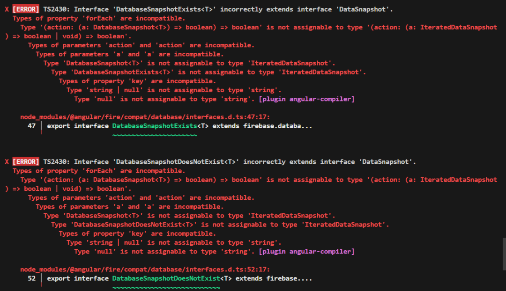

Vá no arquivo ```node_modules\@angular\fire\compat\database\interfaces.d.ts``` e substitua as linhas conforme abaixo:

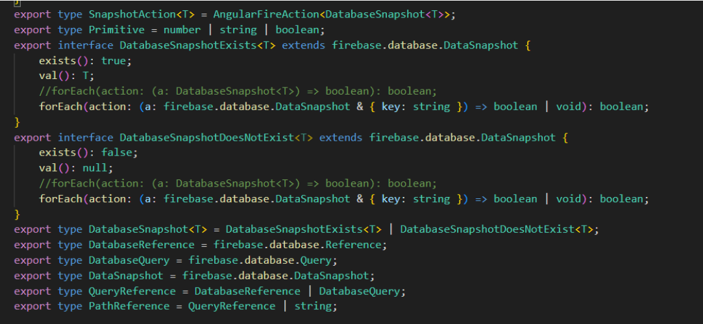

Substitua o código comentado pelo código destacado em vermelho no trecho abaixo:

```
export type SnapshotAction<T> = AngularFireAction<DatabaseSnapshot<T>>;
export type Primitive = number | string | boolean;
export interface DatabaseSnapshotExists<T> extends firebase.database.DataSnapshot {
    exists(): true;
    val(): T;
    //forEach(action: (a: DatabaseSnapshot<T>) => boolean): boolean;
    forEach(action: (a: firebase.database.DataSnapshot & { key: string }) => boolean | void): boolean;
}
export interface DatabaseSnapshotDoesNotExist<T> extends firebase.database.DataSnapshot {
    exists(): false;
    val(): null;
    //forEach(action: (a: DatabaseSnapshot<T>) => boolean): boolean;
    forEach(action: (a: firebase.database.DataSnapshot & { key: string }) => boolean | void): boolean;
}
```

:::danger
Lembre-se de parar a aplicação antes de fazer essa alteração, pois somente salvar com a aplicação levantada, a alteração não irá refletir.
:::

## Atualizando um nó específico
```
this.database.object(`caminho/para/dado/dado_especifico`).update({ dado_especifico: valor });
```

Como podemos ver, mesmo com o nome do nó incluído no caminho informado, dentro do método update() é preciso informar o nó e o novo valor. Só dá certo se for passado em formato de objeto ```{chave:valor}``` (entre chaves mesmo) se passar só o valor entre parênteses, não acontece. 

## Monitorando a alteração de um dado

Na sua service (Que tem no construtor um objeto de AngularFireDatabase), implemente um método como abaixo:
```
dataToObserveChanges(): Observable<any> {
    return this.database.object(`caminho/para/dataToObserve`).valueChanges();
  }
  ```

Onde database é o objeto do tipo AngularFireDatabase implementado no construtor da service.

E no componente que tem essa service injetada no construtor, incluímos:
A variável que representa as mudanças (Crie uma para cada dado a ser monitorado):
```
private dataToObserveSubscription: Subscription | undefined
```

No ngOnInit() inclua a linha abaixo:
```
this.dataToObserveSubscription = this.service.dataToObserveChanges().subscribe(dataToObserve => {
        /faça o que quiser quando for verificada alteração no dado monitora como por exemplo mostrar uma mensagem ou chamar um método
     })

Implemente ngOnDestroy() com um if como abaixo para cada dado monitorado:

ngOnDestroy() {
    if (this. dataToObserveSubscription) {
      this. dataToObserveSubscription.unsubscribe();
    }
  }
```
Obs.: Esse código funciona, mas a primeira vez que testei só funcionou com a tela ativada, daí a ação chamada no .subscribe do item 2. acima não foi chamada e só foi chamada quando a tela for reativada novamente, porém quando fiz teste com outro nó, essa bosta já funcionou, então eu não tenho certeza se funciona sempre ou não.
