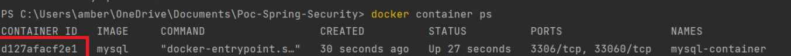
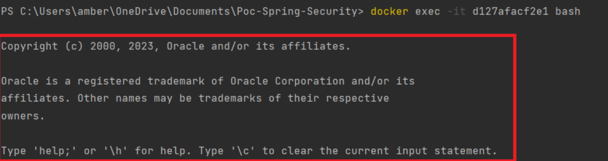

Criar arquivo com nome **docker-compose.yml** e adicionar os comandos abaixo:  
```
version: "3.7"
services:
  db:
    image: mysql
    container_name: mysql-container
    environment:
      MYSQL_ROOT_PASSWORD: 123
    volumes:
      - C:\Users\amber\OneDrive\Documents\volumes:/var/lib/mysql
    ports:
      - "3306:3306"
    restart: always
```

Onde:
- version: **"3.7"** é a versão do docker-compose que será utilizada


- **services** são todos os containers que queremos configurar para subir. Nesse caso, só subimos um container


- **db** foi o nome usado para identificar seu container dentro do docker-compose. Poderia ser qualquer nome. Escolha sempre nomes que tenham a ver com sua aplicação.


- **image** é a imagem usada para subir o container. Nesse caso, ao informar mysql após os dois pontos, estamos informando que queremos usar a imagem padrão do mysql no contida no repositório do docker. 


- **container_name** é o nome do que queremos dar ao container. Esse nome servirá para identificar seu container quando dermos docker container ps ou outro comando que liste os containers.


- **environment** é para configurar variáveis de ambientes. No caso do mysql, podemos definir nome do usuário com MYSQL_USER: nome_desejado, senha de acesso com MYSQL_PASSWORD: senha_desejada, MYSQL_DATABASE: nome_desejado para já criar um banco de dados quando seu container for iniciado,   dentre outras informações.
Se MYSQL_USER não for definido, o usuário será o padrão: root.


- **volumes** é onde definimos diretórios externos ao container. No caso desse container mysql, se o container for finalizado, os dados do banco ficarão salvos em C:\Users\amber\OneDrive\Documents\volumes. 
Se um volume não for configurado, se finalizarmos o container, os dados serão todos perdidos.
- **Restart: always** define que caso seu container por algum motivo pare, ele vai reiniciar automaticamente. 


Salvar esse código em um arquivo com nome **docker-compose.yml**. 

Para subir o container usando o docker-compose, devemos ir pelo terminal para a pasta raiz desse arquivo e dar o comando:
```
docker-compose up -d
```
Onde **-d** é para não prender o terminal.

Por padrão, os comandos **docker-compose…** procuram um arquivo no diretório corrente nomeado como docker-compose.yml, porém é possível indicar um outro nome de arquivo e também em um outro local passando o parâmetro **-f**:  

No mesmo diretório corrente:  
```
docker-compose -f docker-compose-file.yml up
```
Em outro diretório:
-d
```
docker-compose -f /path/to/my/docker-compose-file.yml up
```

Com o **container/mysql** já rodando, podemos acessar seu terminal.   
Para isso primeiramente precisamos identificar o id desse container com o comando **docker container ps**.  
Serão mostradas na tela as informações do container e a primeira informação é **CONTAINER_ID** que é a que queremos obter:

[](./img/criando_docker_compose_mysql/informacoes_container.png)

Já com o id do container em mão, podemos dar o comando para acessar o terminal dele com o comando ```docker exec -it d127afacf2e1 bash```, onde **d127afacf2e1** é o id do container.

Já dentro do container, podemos acessar o mysql pelo terminal com o comando:
```
mysql -u root -p
```
Será solicitada a senha definida no docker-compose na variável **MYSQL_ROOT_PASSWORD**.

Ao acessar com sucesso, será mostrado algo assim:

[](./img/criando_docker_compose_mysql/acessando_termnal_container.png)

Agora podemos dar comandos como por exemplo ```show databases;``` para exibir todos os bancos de dados criados, ```create database nome_desejado;``` para criar um banco de dados, comandos sql para criar tabela, popular tabela, etc.

:::important
									         |
Usando o Windows, sempre que precisar acessar o banco de dados, é preciso iniciar a          
aplicação Docker Desktop.	
